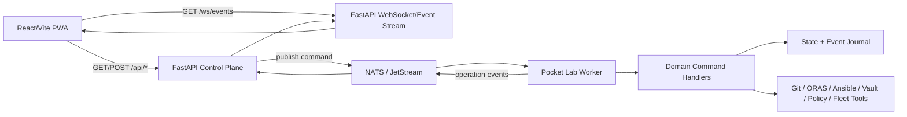
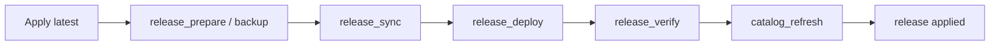
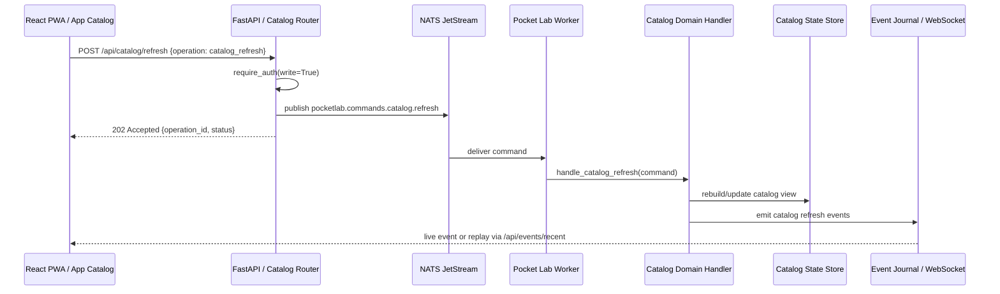
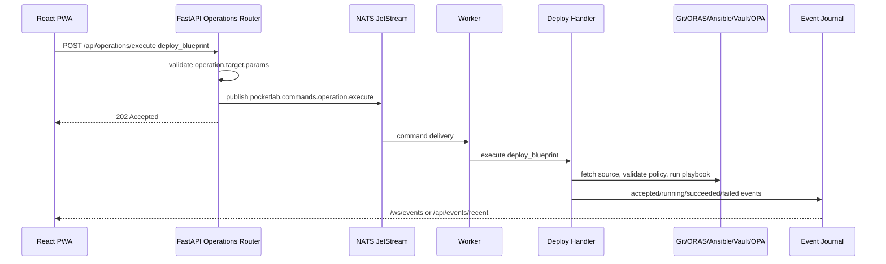

# Pocket Lab Backend API Contract Reference

**Document type:** Enterprise Backend API Contract Reference
**Product:** Pocket Lab
**Architecture state:** FastAPI + NATS/JetStream + Worker + Event-Sourced Workflow Engine
**Audience:** frontend developers, backend developers, QA, release engineers, operators, security reviewers

---

## 1. Purpose

This document defines the backend HTTP, WebSocket, operation, event, and failure-behavior contracts used by the Pocket Lab application.

It is the source of truth for how the React/Vite PWA communicates with the FastAPI control plane and how FastAPI submits typed work into the NATS/JetStream worker layer.

Pocket Lab is an edge-first, self-hosted control-plane application. Its backend API must stay small, explicit, contract-driven, and safe under degraded conditions. The frontend must not call internal third-party APIs directly; it should call Pocket Lab-owned FastAPI endpoints only.

---

## 2. Current Backend Architecture Summary

Pocket Lab now follows the current architecture below:



### 2.1 Key Backend Components

| Component | Responsibility |
|---|---|
| FastAPI app | Owns all HTTP and WebSocket contracts consumed by the PWA. |
| Routers | Group API endpoints by domain: catalog, operations, events, health, release, telemetry, fleet, drift, security, vault, etc. |
| Auth/deps layer | Enforces read/write authentication and request context rules. |
| Action queue / command submitter | Converts HTTP write requests into typed domain commands. |
| NATS bus | Command/event transport between API, worker, fleet agents, and event stream. |
| JetStream | Durable command/event storage, retry, and DLQ support. |
| Worker process | Consumes command subjects and executes domain handlers. |
| Domain command handlers | Implement operations such as catalog refresh, deploy blueprint, rotate secret, fleet join, drift scan, release apply, and backup/restore. |
| Event journal | Records operation lifecycle and supports recovery/state reconstruction. |
| State directory | Stores local runtime state, workflow journal, catalog state, fleet records, backups, and release state. |
| WebSocket/event bridge | Streams operation, health, fleet, release, and audit events to the UI. |

---

## 3. API Design Principles

Pocket Lab backend APIs follow these rules:

1. **Pocket Lab owns the frontend contract.** The frontend calls `/api/*` endpoints implemented by FastAPI, not raw Gatus, NATS, Vault, Gitea, Loki, or tool-native APIs.
2. **Writes are typed operations.** Mutating actions must flow through typed operations, domain commands, or approved POST endpoints that submit domain commands.
3. **No legacy compatibility paths.** The current architecture does not use `/api/action/update`, `legacy_intent`, `sync_bash`, or `tofu_deploy` as user-facing or frontend write contracts.
4. **Fail closed.** If FastAPI, NATS, JetStream, or the worker cannot safely accept a write, the API must reject the write instead of running an unsafe local fallback.
5. **Read endpoints degrade gracefully.** Read endpoints should return degraded snapshots or fallback summaries where safe.
6. **Events are redacted.** Event payloads, journals, logs, and WebSocket streams must not expose secrets.
7. **Correlation is mandatory for operations.** Operation IDs, task IDs, event IDs, and correlation IDs should be preserved across API, NATS, worker, journal, and UI.
8. **OpenAPI governs frontend calls.** `task check:api-contract` must pass whenever frontend API calls change.

---

## 4. API Surface Map

### 4.1 High-Level Endpoint Groups

| Domain | Endpoint family | Purpose |
|---|---|---|
| Health/readiness | `/health`, `/ready`, `/api/health-engine.json` | Health, readiness, and service-status snapshots. |
| Control plane status | `/api/nats/status`, `/api/workers/status` | NATS, JetStream, and worker readiness. |
| Catalog | `/api/catalog.json`, `/api/catalog/refresh` | App Catalog / Apps & Services state and refresh action. |
| Operations | `/api/operations/preview`, `/api/operations/execute`, `/api/operations/{id}` | Generic typed operation preview, execution, and status. |
| Events | `/api/events/recent`, `/ws/events` | Recent event replay and live event stream. |
| Release workflow | `/api/release/self-update/status`, `/check`, `/apply`; release workflow endpoints | Self-update, release check/apply, timeline, and orchestration. |
| Drift | drift summary/status/scan endpoints | Desired vs actual-state detection. |
| Fleet | fleet status/agent/join endpoints | Mesh Fleet / device lifecycle. |
| NOC telemetry | telemetry endpoints | CPU, memory, disk, temperature, and system status. |
| Identity/Vault | vault/secret endpoints | Secret rotation and access state. |
| Security posture | security/policy posture endpoints | Safety Center / Security Posture data. |
| Disaster recovery | backup/restore endpoints or operations | Backup, restore, verify, rollback flows. |

---

## 5. Common Request and Response Rules

### 5.1 Common Headers

| Header | Direction | Required | Description |
|---|---|---|---|
| `Accept: application/json` | request | recommended | Expected for all JSON API calls. |
| `Content-Type: application/json` | request | required for JSON POST | Required for typed write requests. |
| `Authorization: Bearer <token>` | request | deployment-dependent | Required when auth is enabled. |
| `X-Correlation-ID` | request/response | recommended | Used to correlate API, NATS, worker, journal, and UI events. |

### 5.2 Common Success Response Fields

| Field | Type | Meaning |
|---|---|---|
| `status` | string | `ok`, `healthy`, `degraded`, `accepted`, `running`, `succeeded`, `failed`, etc. |
| `operation_id` | string | Unique operation identifier. |
| `task_id` | string | UI-friendly task identifier; may equal operation ID. |
| `job_id` | string | Legacy-compatible label for UI job tracking where still used internally as a display alias. |
| `subject` | string | NATS subject used or implied by the command/event. |
| `correlation_id` | string | Cross-layer request correlation ID. |
| `message` | string | Human-readable result or status summary. |
| `updated_at` | string | ISO-8601 timestamp for changed state. |

### 5.3 Common Error Response Fields

| Field | Type | Meaning |
|---|---|---|
| `detail` | string/object | FastAPI-native error detail. |
| `error` | string | Human-readable error message. |
| `code` | string | Stable machine-readable error code. |
| `status` | string | Usually `error`, `failed`, `blocked`, or `degraded`. |
| `correlation_id` | string | Request correlation ID, if available. |
| `retryable` | boolean | Whether retrying may succeed. |

### 5.4 Status Code Rules

| HTTP status | Meaning in Pocket Lab |
|---|---|
| `200 OK` | Read succeeded or synchronous action returned a snapshot. |
| `202 Accepted` | Write accepted and queued as typed work. |
| `400 Bad Request` | Invalid request shape, operation, target, or params. |
| `401 Unauthorized` | Missing/invalid auth. |
| `403 Forbidden` | Authenticated but not allowed, or write auth denied. |
| `404 Not Found` | Unknown resource, operation ID, agent, backup, or route. |
| `405 Method Not Allowed` | Route exists but method is not allowed; e.g. `GET /api/catalog/refresh`. |
| `409 Conflict` | Conflicting operation state or unsafe concurrent action. |
| `422 Unprocessable Entity` | FastAPI validation failure. |
| `503 Service Unavailable` | Control plane cannot safely accept write; fail-closed behavior. |

---

## 6. Health and Readiness API

### 6.1 `GET /health`

Basic process health check.

| Attribute | Value |
|---|---|
| Method | `GET` |
| Auth | read auth, if enabled |
| Used by | probes, smoke checks, operators |
| Expected behavior | Returns a simple healthy response if FastAPI is alive. |

Example response:

```json
{
  "status": "ok"
}
```

### 6.2 `GET /ready`

Readiness check for the control plane.

| Field | Description |
|---|---|
| `fastapi` | Whether API process is ready. |
| `nats` | Whether NATS is reachable. |
| `jetstream` | Whether JetStream is available. |
| `worker` | Whether worker is connected/ready. |
| `ready` | Overall readiness. |

Example response:

```json
{
  "ready": false,
  "fastapi": true,
  "nats": false,
  "jetstream": false,
  "worker": true,
  "status": "degraded"
}
```

### 6.3 `GET /api/health-engine.json`

Returns Pocket Lab-owned health-engine snapshot. The frontend must use this route instead of raw Gatus internal paths.

| Attribute | Value |
|---|---|
| Method | `GET` |
| Auth | read auth, if enabled |
| Frontend usage | Health Engine panel, System Status, degraded banner, simple mode health summaries |
| Degraded behavior | Returns fallback or degraded snapshot when external checks are unavailable. |

Example response:

```json
{
  "status": "degraded",
  "overall": "degraded",
  "source": "gatus",
  "summary": {
    "healthy": 4,
    "warning": 0,
    "degraded": 1,
    "unavailable": 0,
    "unknown": 0,
    "total": 5
  },
  "services": {
    "fastapi": { "status": "healthy", "message": "API ready" },
    "nats": { "status": "healthy", "message": "NATS reachable" },
    "worker": { "status": "healthy", "message": "Worker connected" },
    "vault": { "status": "sealed", "message": "Vault sealed" }
  },
  "last_scan": "2026-06-07T16:00:00Z"
}
```

Frontend defensive rule:

```js
const services = health?.services && typeof health.services === 'object'
  ? health.services
  : {};
```

The UI must handle service values as either strings or objects.

---

## 7. Control Plane Status API

### 7.1 `GET /api/nats/status`

Returns NATS and JetStream status.

Example response:

```json
{
  "status": "healthy",
  "connected": true,
  "jetstream": true,
  "server": "nats://127.0.0.1:4222",
  "message": "NATS and JetStream available"
}
```

Degraded response example:

```json
{
  "status": "unavailable",
  "connected": false,
  "jetstream": false,
  "message": "NATS unavailable"
}
```

### 7.2 `GET /api/workers/status`

Returns worker readiness.

Example response:

```json
{
  "status": "ready",
  "available": true,
  "workers": [
    {
      "id": "worker-local",
      "status": "ready",
      "last_seen": "2026-06-07T16:00:00Z"
    }
  ]
}
```

Fail-closed implication:

If `/api/nats/status` or `/api/workers/status` is unavailable/degraded, write endpoints must not silently fall back to local shell execution.

---

## 8. Catalog API

The Catalog API backs App Catalog / Apps & Services.

### 8.1 `GET /api/catalog.json`

Returns catalog items as an array.

| Attribute | Value |
|---|---|
| Method | `GET` |
| Auth | read auth |
| UI usage | App Catalog screen, Apps & Services simple mode |
| Required response shape | top-level array |

Example response:

```json
[
  {
    "id": "gitea",
    "name": "Gitea",
    "title": "Gitea",
    "description": "Self-hosted Git service",
    "category": "DevOps",
    "status": "available",
    "source_type": "repository",
    "blueprint": "gitea"
  },
  {
    "id": "vault",
    "name": "Vault",
    "title": "Vault",
    "description": "Secrets and access management",
    "category": "Security",
    "status": "degraded",
    "source_type": "repository",
    "blueprint": "vault"
  }
]
```

Frontend defensive normalization:

```js
function normalizeCatalogItems(value) {
  if (Array.isArray(value)) return value;
  if (Array.isArray(value?.catalog)) return value.catalog;
  if (Array.isArray(value?.items)) return value.items;
  if (Array.isArray(value?.apps)) return value.apps;
  if (Array.isArray(value?.blueprints)) return value.blueprints;
  return [];
}
```

### 8.2 `GET /api/catalog/refresh`

This route intentionally rejects GET.

| Attribute | Value |
|---|---|
| Method | `GET` |
| Expected status | `405 Method Not Allowed` |
| Purpose | Prevent accidental read-based mutation. |

Example error:

```json
{
  "detail": "Use POST for catalog refresh"
}
```

### 8.3 `POST /api/catalog/refresh`

Submits a typed catalog refresh command.

| Attribute | Value |
|---|---|
| Method | `POST` |
| Auth | write auth |
| Expected status | `202 Accepted` |
| Command subject | `pocketlab.commands.catalog.refresh` |
| Event name | `catalog.refresh.requested` |
| UI entry point | App Catalog → Refresh catalog / Check for New Apps |

Recommended request body:

```json
{
  "operation": "catalog_refresh",
  "target": {
    "kind": "app_catalog",
    "ref": "default"
  },
  "params": {
    "source": "app_catalog"
  }
}
```

Backend may ignore body fields if it submits a fixed domain command, but the frontend should still send a typed payload for observability and contract clarity.

Example accepted response:

```json
{
  "operation_id": "catalog-refresh-20260607-160240",
  "task_id": "catalog-refresh-20260607-160240",
  "status": "accepted",
  "operation": "catalog_refresh",
  "subject": "pocketlab.commands.catalog.refresh",
  "message": "Catalog refresh accepted"
}
```

Fail-closed response example:

```json
{
  "status": "blocked",
  "error": "NATS/JetStream worker execution is required; local execution is disabled.",
  "retryable": true
}
```

---

## 9. Generic Operations API

The Operations API is used by tabs that submit typed operations such as GitOps, Blueprint Registry, Drift Center, Mesh Fleet, Identity Vault, Policy Guardrails, Disaster Recovery, and Release Workflow.

### 9.1 Typed Operation Request Shape

```json
{
  "operation": "deploy_blueprint",
  "target": {
    "kind": "blueprint",
    "ref": "gitea"
  },
  "params": {
    "playbook": "site.yml",
    "source": "gitea",
    "source_type": "repository"
  },
  "correlation_id": "ui-generated-id"
}
```

### 9.2 `POST /api/operations/preview`

Returns the expected effect without executing the operation.

| Attribute | Value |
|---|---|
| Method | `POST` |
| Auth | read or write-preview auth depending on deployment |
| Used by | preview panels, guided actions, safety confirmation |
| Mutates state | no |

Example request:

```json
{
  "operation": "restore_backup",
  "target": {
    "kind": "backup",
    "ref": "backup-20260607"
  },
  "params": {
    "dry_run": true
  }
}
```

Example response:

```json
{
  "status": "preview",
  "operation": "restore_backup",
  "estimated_changes": [
    "Restore state directory",
    "Overwrite catalog cache",
    "Restart worker process"
  ],
  "warnings": [
    "Existing state may be overwritten"
  ]
}
```

### 9.3 `POST /api/operations/execute`

Submits a typed operation for execution.

| Attribute | Value |
|---|---|
| Method | `POST` |
| Auth | write auth |
| Expected status | `202 Accepted` |
| Mutates state | yes, via worker/domain handler |
| Safety rule | fail closed if NATS/JetStream/worker is unavailable |

Example request:

```json
{
  "operation": "git_sync",
  "target": {
    "kind": "gitops_repo",
    "ref": "pocket_lab_iac"
  },
  "params": {
    "branch": "main",
    "source": "gitops_tab"
  }
}
```

Example response:

```json
{
  "operation_id": "op-01JZABCDEF",
  "task_id": "op-01JZABCDEF",
  "job_id": "op-01JZABCDEF",
  "status": "accepted",
  "operation": "git_sync",
  "subject": "pocketlab.commands.operation.execute",
  "correlation_id": "corr-01JZABCDEF"
}
```

Fail-closed example:

```json
{
  "status": "blocked",
  "error": "Pocket Lab worker is unavailable; NATS/JetStream worker execution is required.",
  "retryable": true,
  "code": "WORKER_UNAVAILABLE"
}
```

### 9.4 `GET /api/operations/{operation_id}`

Returns current operation status.

Example response:

```json
{
  "operation_id": "op-01JZABCDEF",
  "status": "running",
  "operation": "deploy_blueprint",
  "phase": "ansible_apply",
  "progress": 45,
  "started_at": "2026-06-07T16:00:00Z",
  "updated_at": "2026-06-07T16:00:10Z",
  "events": [
    {
      "type": "operation.accepted",
      "message": "Operation accepted"
    },
    {
      "type": "operation.running",
      "message": "Running playbook"
    }
  ]
}
```

---

## 10. Typed Operation Catalog

| Operation | UI entry point | Primary backend route | NATS subject / handler intent | Purpose |
|---|---|---|---|---|
| `catalog_refresh` | App Catalog → Refresh catalog | `POST /api/catalog/refresh` | `pocketlab.commands.catalog.refresh` | Refresh Apps & Services catalog. |
| `deploy_blueprint` | App Catalog / Blueprint Registry → Deploy Workload / Install | `POST /api/operations/execute` | `pocketlab.commands.operation.execute` | Deploy a blueprint or workload. |
| `git_sync` | GitOps Pipeline | `POST /api/operations/execute` | `pocketlab.commands.operation.execute` | Sync GitOps repository. |
| `drift_scan` | Drift Center | `POST /api/operations/execute` | `pocketlab.commands.operation.execute` | Detect desired vs actual-state drift. |
| `backup_now` | Disaster Recovery | `POST /api/operations/execute` | `pocketlab.commands.operation.execute` | Create backup snapshot. |
| `restore_backup` | Disaster Recovery | `POST /api/operations/execute` | `pocketlab.commands.operation.execute` | Restore from backup. |
| `backup_verify` | Disaster Recovery | `POST /api/operations/execute` | `pocketlab.commands.operation.execute` | Verify backup integrity. |
| `rotate_secret` | Identity Vault | `POST /api/operations/execute` or vault-specific route | `pocketlab.commands.vault.rotate` | Rotate managed secret. |
| `secret_read_dynamic` | Identity Vault | `POST /api/operations/execute` | vault/domain command | Issue dynamic secret safely. |
| `fleet_join` | Mesh Fleet | `POST /api/operations/execute` or fleet-specific route | `pocketlab.commands.fleet` | Generate device join/onboarding payload. |
| `policy_deploy` | Policy Guardrails | `POST /api/operations/execute` | domain command | Deploy/evaluate policy bundle. |
| `release_prepare` | Release Workflow | release/apply orchestration | release orchestrator | Prepare release, usually backup. |
| `release_sync` | Release Workflow | release/apply orchestration | release orchestrator | Sync repo/artifact. |
| `release_deploy` | Release Workflow | release/apply orchestration | release orchestrator | Deploy release changes. |
| `release_verify` | Release Workflow | release/apply orchestration | release orchestrator | Verify release/drift. |
| `release_apply` | Release Workflow → Apply latest | `POST /api/release/self-update/apply` | release orchestrator | Full update workflow. |

---

## 11. Event API

### 11.1 `GET /api/events/recent`

Returns recent event journal entries.

| Query parameter | Type | Description |
|---|---|---|
| `limit` | integer | Max number of events. |
| `subject_prefix` | string | Optional subject prefix filter. |

Example request:

```text
GET /api/events/recent?limit=25&subject_prefix=pocketlab.events.health.
```

Example response:

```json
{
  "events": [
    {
      "id": "evt-001",
      "subject": "pocketlab.events.operation.accepted",
      "operation": "catalog_refresh",
      "status": "accepted",
      "message": "Catalog refresh accepted",
      "time": "2026-06-07T16:00:00Z",
      "correlation_id": "corr-001"
    }
  ]
}
```

### 11.2 `GET /ws/events` or WebSocket `/ws/events`

Streams live event updates to the frontend.

| Attribute | Value |
|---|---|
| Protocol | WebSocket |
| Used by | live progress panels, Log Explorer, App Catalog events, Release Workflow, Health Engine |
| Fallback | `/api/events/recent` replay |

Example event:

```json
{
  "id": "evt-002",
  "subject": "pocketlab.events.operation.running",
  "operation_id": "op-001",
  "operation": "deploy_blueprint",
  "status": "running",
  "message": "Running deployment playbook",
  "timestamp": "2026-06-07T16:01:00Z"
}
```

Frontend fallback rule:

If WebSocket is unavailable, the UI should show reconnecting/fallback state and continue to support manual replay through `/api/events/recent`.

---

## 12. NATS / JetStream Contract Summary

### 12.1 Command Subjects

| Subject | Producer | Consumer | Purpose |
|---|---|---|---|
| `pocketlab.commands.operation.execute` | FastAPI | Worker | Generic typed operation execution. |
| `pocketlab.commands.catalog.refresh` | FastAPI | Worker/domain handler | Refresh catalog. |
| `pocketlab.commands.vault.rotate` | FastAPI/UI action | Worker/domain handler | Rotate secret. |
| `pocketlab.commands.fleet` | FastAPI/fleet UI | Worker/fleet handler | Fleet operations. |

### 12.2 Event Subjects

| Subject family | Purpose |
|---|---|
| `pocketlab.events.operation.*` | Operation lifecycle: accepted, running, succeeded, failed. |
| `pocketlab.events.health.*` | Health/degraded mode updates. |
| `pocketlab.events.fleet.*` | Fleet agent state changes. |
| `pocketlab.events.release.*` | Release timeline and update events. |
| `pocketlab.audit` | Audit trail. |
| `pocketlab.dlq` | Dead-lettered commands/events. |

### 12.3 Required Event Fields

| Field | Required | Meaning |
|---|---|---|
| `id` | yes | Unique event ID. |
| `subject` | yes | NATS/event subject. |
| `timestamp` or `time` | yes | Event time. |
| `status` | recommended | accepted/running/succeeded/failed/degraded. |
| `operation` | for operation events | Operation name. |
| `operation_id` | for operation events | Operation identifier. |
| `correlation_id` | recommended | End-to-end correlation. |
| `message` | recommended | Human-readable status. |

---

## 13. Release Workflow API

### 13.1 `GET /api/release/self-update/status`

Returns current release/update state.

Example response:

```json
{
  "status": "idle",
  "current_version": "unknown",
  "target_version": "latest",
  "release": "latest",
  "mode": "manual",
  "checking": false,
  "last_checked": null,
  "last_applied": null,
  "timeline": []
}
```

### 13.2 `POST /api/release/self-update/check`

Checks release source for a newer version.

Example response:

```json
{
  "status": "checked",
  "current_version": "v1.0.0",
  "latest_version": "v1.0.1",
  "update_available": true
}
```

### 13.3 `POST /api/release/self-update/apply`

Runs release workflow.

Expected high-level flow:



Example response:

```json
{
  "operation_id": "release-20260607-1600",
  "status": "accepted",
  "timeline": [
    { "step": "backup", "status": "pending" },
    { "step": "sync", "status": "pending" },
    { "step": "deploy", "status": "pending" },
    { "step": "verify", "status": "pending" },
    { "step": "catalog_refresh", "status": "pending" }
  ]
}
```

Failure example:

```json
{
  "status": "failed",
  "reason": "release artifact verification failed",
  "timeline": [
    { "step": "verify", "status": "failed" }
  ]
}
```

---

## 14. NOC Telemetry API

Telemetry powers NOC Telemetry / System Status.

Expected normalized response:

```json
{
  "cpu_usage_percent": 23.5,
  "memory_usage_mb": 1024,
  "free_space_mb": 2048,
  "cpu_temp_c": 48.2,
  "status": "healthy",
  "updated_at": "2026-06-07T16:00:00Z"
}
```

Frontend compatibility rule:

The UI may defensively support old camelCase fields, but the backend contract should prefer snake_case fields:

| Current field | Meaning |
|---|---|
| `cpu_usage_percent` | CPU usage percentage. |
| `memory_usage_mb` | Used memory in MB. |
| `free_space_mb` | Available disk space in MB. |
| `cpu_temp_c` | CPU temperature in Celsius. |

Degraded example:

```json
{
  "cpu_usage_percent": 91.5,
  "memory_usage_mb": 3800,
  "free_space_mb": 512,
  "cpu_temp_c": 74.2,
  "status": "warning",
  "message": "Low disk space"
}
```

---

## 15. Drift API

Drift endpoints power Drift Center / Health & Issues.

Expected drift summary shape:

```json
{
  "status": "drift_detected",
  "drift_detected": true,
  "summary": "Something changed from desired state",
  "items": [
    {
      "id": "drift-001",
      "resource": "gitea.service",
      "desired": "running",
      "actual": "stopped",
      "severity": "warning"
    }
  ],
  "updated_at": "2026-06-07T16:00:00Z"
}
```

Drift scan should be submitted as a typed operation when it mutates state or triggers worker work:

```json
{
  "operation": "drift_scan",
  "target": {
    "kind": "environment",
    "ref": "local-edge"
  },
  "params": {
    "scope": "all"
  }
}
```

---

## 16. Fleet API

Fleet endpoints power Mesh Fleet / My Devices.

Expected fleet agents shape:

```json
{
  "agents": [
    {
      "id": "edge-01",
      "name": "edge-01",
      "role": "compute",
      "status": "online",
      "last_seen": "2026-06-07T16:00:00Z",
      "version": "0.1.0"
    },
    {
      "id": "edge-02",
      "name": "edge-02",
      "role": "storage",
      "status": "stale",
      "last_seen": "2026-06-07T12:00:00Z"
    }
  ]
}
```

Fleet join should submit typed work:

```json
{
  "operation": "fleet_join",
  "target": {
    "kind": "fleet",
    "ref": "local"
  },
  "params": {
    "role": "compute",
    "device_name": "edge-03"
  }
}
```

Safety rule:

Fleet join payloads must not expose long-lived secrets in UI logs or event streams.

---

## 17. Identity Vault API

Identity Vault powers Passwords & Access / secret operations.

Expected high-level actions:

| Action | Backend contract |
|---|---|
| Rotate secret | typed operation `rotate_secret` or command `pocketlab.commands.vault.rotate`. |
| Read dynamic secret | typed operation `secret_read_dynamic`; response must be short-lived and redacted in logs. |
| Vault health | exposed through `/api/health-engine.json`, not direct Vault UI calls. |

Example rotate request:

```json
{
  "operation": "rotate_secret",
  "target": {
    "kind": "secret",
    "ref": "database/admin"
  },
  "params": {
    "reason": "operator_request"
  }
}
```

Example accepted response:

```json
{
  "operation_id": "secret-rotate-001",
  "status": "accepted",
  "operation": "rotate_secret",
  "subject": "pocketlab.commands.vault.rotate"
}
```

Redaction rule:

Responses, logs, events, and journals must not include secret values, tokens, passwords, private keys, recovery keys, or root material.

---

## 18. Security Posture and Policy API

Security Posture / Safety Center and Policy Guardrails consume posture and policy data.

Expected posture response:

```json
{
  "status": "warning",
  "score": 82,
  "findings": [
    {
      "id": "sec-001",
      "title": "Vault sealed",
      "severity": "high",
      "status": "open",
      "recommendation": "Unseal Vault before rotating secrets"
    }
  ],
  "updated_at": "2026-06-07T16:00:00Z"
}
```

Policy deploy operation:

```json
{
  "operation": "policy_deploy",
  "target": {
    "kind": "policy_bundle",
    "ref": "default"
  },
  "params": {
    "mode": "enforce"
  }
}
```

---

## 19. Disaster Recovery API / Operations

Disaster Recovery should use typed operations for mutating work.

### 19.1 Backup Now

```json
{
  "operation": "backup_now",
  "target": {
    "kind": "state_dir",
    "ref": "default"
  },
  "params": {
    "include_catalog": true,
    "include_journal": true
  }
}
```

### 19.2 Verify Backup

```json
{
  "operation": "backup_verify",
  "target": {
    "kind": "backup",
    "ref": "backup-20260607"
  },
  "params": {}
}
```

### 19.3 Restore Backup

Restore should support preview first:

```json
{
  "operation": "restore_backup",
  "target": {
    "kind": "backup",
    "ref": "backup-20260607"
  },
  "params": {
    "preview": true
  }
}
```

Then execution:

```json
{
  "operation": "restore_backup",
  "target": {
    "kind": "backup",
    "ref": "backup-20260607"
  },
  "params": {
    "confirm": true
  }
}
```

---

## 20. Frontend-to-Backend Screen Mapping

| UI screen | Primary read APIs | Primary write APIs / operations |
|---|---|---|
| App Catalog | `/api/catalog.json`, `/api/events/recent`, `/api/health-engine.json` | `POST /api/catalog/refresh`, `deploy_blueprint` |
| System Map | health, telemetry, status APIs | usually read-only; may trigger refresh/check actions |
| GitOps Pipeline | operation/status/event APIs | `git_sync` |
| Blueprint Registry | catalog/blueprint APIs | `deploy_blueprint`, rollback/import operations |
| Identity Vault | health/vault state APIs | `rotate_secret`, `secret_read_dynamic` |
| Log Explorer | `/api/events/recent`, `/ws/events` | replay/clear are UI-local unless persisted |
| Policy Guardrails | security/policy state APIs | `policy_deploy` |
| NOC Telemetry | telemetry API, health API | refresh/check actions only |
| Security Posture | security posture API, health API | policy/security scan operation if available |
| Drift Center | drift summary/status APIs | `drift_scan` |
| Release Workflow | release status/check APIs, events | `POST /api/release/self-update/check`, `POST /api/release/self-update/apply` |
| Mesh Fleet | fleet agents/status APIs | `fleet_join` |
| Disaster Recovery | backup list/status APIs | `backup_now`, `backup_verify`, `restore_backup` |
| Settings | config/status APIs | mode changes are usually UI-local; runtime config changes require typed operations |

---

## 21. Authentication and Authorization Contract

The backend should distinguish read and write access.

| Request type | Expected auth level |
|---|---|
| Health/readiness | public or read auth depending on deployment. |
| Status/read APIs | read auth. |
| POST write APIs | write auth. |
| Secret/fleet/release/restore actions | elevated write auth or confirmation where enabled. |

Backend dependency pattern:

```python
deps.require_auth(request)
deps.require_auth(request, write=True)
```

Security expectations:

1. Read-only users cannot trigger operations.
2. Write endpoints reject unauthenticated requests.
3. Secret-bearing operations redact sensitive output.
4. Dangerous actions, such as restore and release apply, should support preview/confirmation UX.

---

## 22. Fail-Closed and Degraded-Mode Contract

Pocket Lab write APIs must fail closed when command execution cannot be guaranteed.

### 22.1 NATS Down

Expected write response:

```json
{
  "status": "blocked",
  "error": "NATS/JetStream worker execution is required; local execution is disabled.",
  "code": "NATS_UNAVAILABLE",
  "retryable": true
}
```

### 22.2 Worker Down

```json
{
  "status": "blocked",
  "error": "Pocket Lab worker is unavailable; NATS/JetStream worker execution is required.",
  "code": "WORKER_UNAVAILABLE",
  "retryable": true
}
```

### 22.3 Vault Sealed

Read APIs may return degraded status. Secret writes should fail or queue only if safe.

```json
{
  "status": "degraded",
  "service": "vault",
  "message": "Vault sealed"
}
```

### 22.4 WebSocket Unavailable

The UI should fall back to `/api/events/recent`.

```json
{
  "status": "reconnecting",
  "fallback": "/api/events/recent"
}
```

---

## 23. Redaction Contract

The following values must never appear in API responses, event journals, WebSocket messages, or UI logs:

- passwords
- bearer tokens
- Vault root tokens
- Vault unseal keys
- private keys
- SSH keys
- API tokens
- recovery keys
- database passwords
- Tailscale auth keys
- raw secret values

Use redacted markers:

```json
{
  "secret": "[REDACTED]"
}
```

or omit the field entirely.

---

## 24. OpenAPI Governance

Pocket Lab uses OpenAPI as the contract boundary between frontend and backend.

### 24.1 Required Gate

```bash
task check:api-contract
```

This gate should:

1. export FastAPI OpenAPI to `contracts/openapi.json`,
2. scan frontend API calls,
3. verify each frontend API path exists in OpenAPI,
4. fail if stale frontend paths are introduced.

### 24.2 Prohibited Frontend API Patterns

Frontend code must not call:

```text
/api/v1/endpoints/statuses
/api/action/update
```

The first is a raw Gatus internal API path. The frontend must use:

```text
/api/health-engine.json
```

The second is a retired compatibility path and must not be reintroduced.

### 24.3 Required Update Rule

If a developer changes any of these, this document must be updated:

- FastAPI route
- request shape
- response shape
- NATS subject
- operation name
- event payload
- auth requirement
- fail-closed behavior
- frontend API call

---

## 25. API Contract Checklist for New Features

Before merging a new backend or frontend feature:

- [ ] Does the frontend call a Pocket Lab-owned FastAPI route?
- [ ] Is the route present in OpenAPI?
- [ ] Is the write action expressed as a typed operation or domain command?
- [ ] Does the route fail closed if NATS/worker is unavailable?
- [ ] Are secrets redacted from responses/events/logs?
- [ ] Are event payloads correlated with operation IDs?
- [ ] Is the UI resilient to degraded/malformed responses?
- [ ] Does `task check:api-contract` pass?
- [ ] Does `task test:e2e` cover the user-facing workflow?
- [ ] Does `task test:faults` cover degraded behavior if the feature writes state?

---

## 26. Appendix: Example End-to-End Operation Flow

### App Catalog Refresh



### Deploy Blueprint


