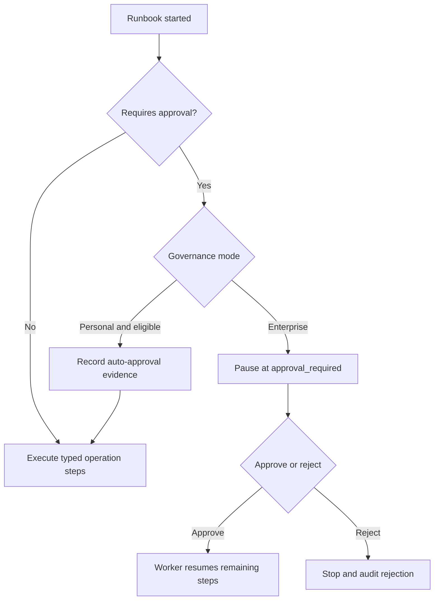

# Approvals Architecture

Pocket Lab supports governed runbooks without making every self-hosted install feel like an enterprise change-management system.

## Modes

| Governance mode | Behavior |
| --- | --- |
| Personal | Safe eligible operations may be auto-approved with audit evidence. |
| Enterprise | Governed runbooks pause for role-aware human approval or rejection. |

## Approval flow

## Canonical references

- [Adaptive Approval Policies and Enterprise Mode](../runtime/adaptive-approval-enterprise-mode.md)
- [Runbook Approval and Resume Lifecycle](../runtime/runbook-approval-lifecycle.md)
- [Runbook Approval Matrix](../operations/generated/runbooks/approval-matrix.md)
