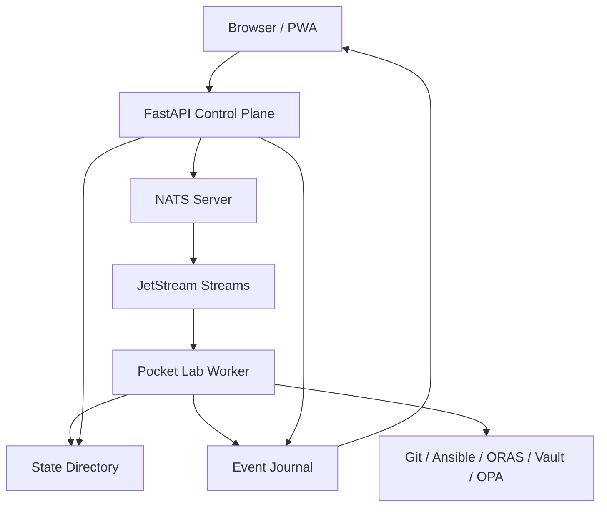
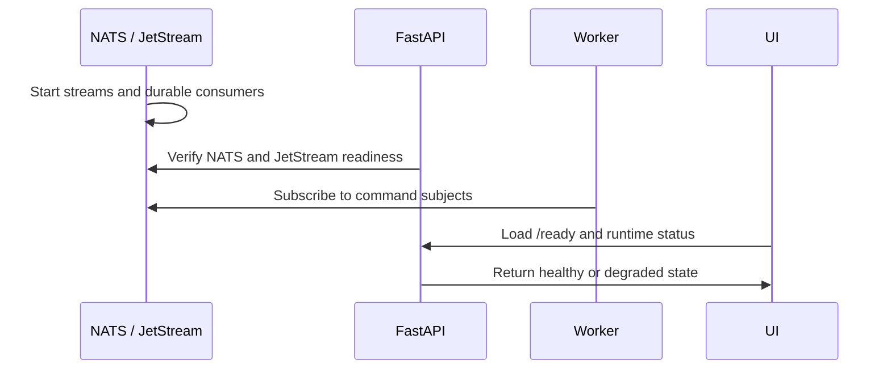
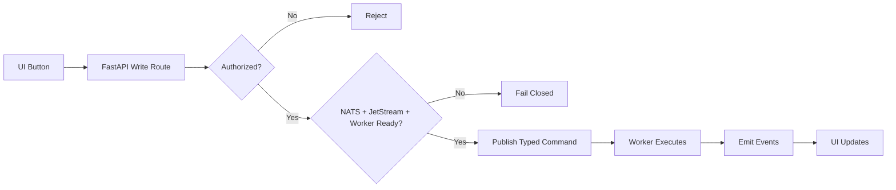

# Deployment / Runtime Blueprint

## Purpose

This blueprint describes how Pocket Lab runs as a production-style edge control plane. It focuses on runtime components, process boundaries, state, startup order, and safety behavior.

## Runtime Topology

## Core Runtime Components

| Component | Responsibility |
|---|---|
| React/Vite PWA | Operator interface and workflow launcher. |
| FastAPI | API contract, readiness, route validation, and command submission. |
| NATS | Command and event transport. |
| JetStream | Durable command/event persistence. |
| Worker | Executes typed operations and emits lifecycle events. |
| Event journal | Supports replay, recovery, and operator evidence. |
| State directory | Stores runtime state, catalog state, workflow state, fleet metadata, release state, and backup metadata. |

## Startup Order

Recommended order:

1. Start NATS with JetStream enabled.
2. Start FastAPI.
3. Start the Pocket Lab worker.
4. Serve the PWA/static frontend.
5. Start optional observability and fleet integrations.

## State Model

| State Category | Examples |
|---|---|
| Operation state | Accepted, running, succeeded, failed, retrying, dead-lettered. |
| Event journal | Append-only operation, health, release, fleet, and audit events. |
| Catalog state | App/blueprint metadata and refresh results. |
| Release state | Current version, target version, release stages, failures. |
| Fleet state | Agent ID, role, last seen, status, telemetry. |
| Backup state | Backup references, manifests, checksums, verification status. |

## Runtime Readiness

Pocket Lab distinguishes health from readiness.

| State | Meaning |
|---|---|
| Healthy | API, NATS, JetStream, worker, and state are available. |
| Degraded | Reads may work but writes may be blocked. |
| Unavailable | Control plane cannot operate safely. |
| Maintenance | A dependency is intentionally unavailable. |

## Write Flow

## Runtime Environment Variables

| Variable | Purpose |
|---|---|
| `POCKETLAB_STATE_DIR` | Root state directory. |
| `POCKETLAB_NATS_URL` | NATS connection URL. |
| `POCKETLAB_NATS_REQUIRED` | Enforces NATS requirement for write safety. |
| `POCKETLAB_NATS_REQUIRE_JETSTREAM` | Enforces JetStream requirement. |
| `POCKETLAB_AUTH_TOKEN` | Optional API authentication token. |
| `POCKETLAB_WRITE_TOKEN` | Optional write-protection token. |
| `POCKETLAB_RELEASE_CHANNEL` | Release channel selection. |
| `POCKETLAB_LOG_LEVEL` | Runtime logging verbosity. |

## Network Interfaces

| Interface | Consumer | Purpose |
|---|---|---|
| `/health` | Supervisors | Basic API liveness. |
| `/ready` | UI / supervisors | Runtime readiness and degraded state. |
| `/api/*` | UI | Backend API contract. |
| `/ws/events` | UI | Live event stream. |
| NATS subjects | API / worker / agents | Durable commands and events. |

## Deployment Units

| Unit | Required | Notes |
|---|---|---|
| PWA static bundle | Yes | Built from React/Vite. |
| FastAPI service | Yes | Owns API contract. |
| Worker service | Yes | Owns operation execution. |
| NATS + JetStream | Yes | Required for safe writes. |
| Persistent state volume | Yes | Required for replay/recovery. |
| Optional tools | Depends | Git, Ansible, ORAS, Vault, OPA, etc. |

## Backup Scope

Backups should include state, event journal, operation history, release metadata, fleet metadata, catalog metadata, and backup manifests. Secrets should only be included if encrypted and explicitly governed by the secret-handling policy.
