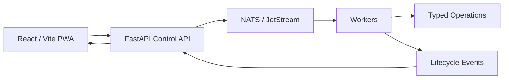
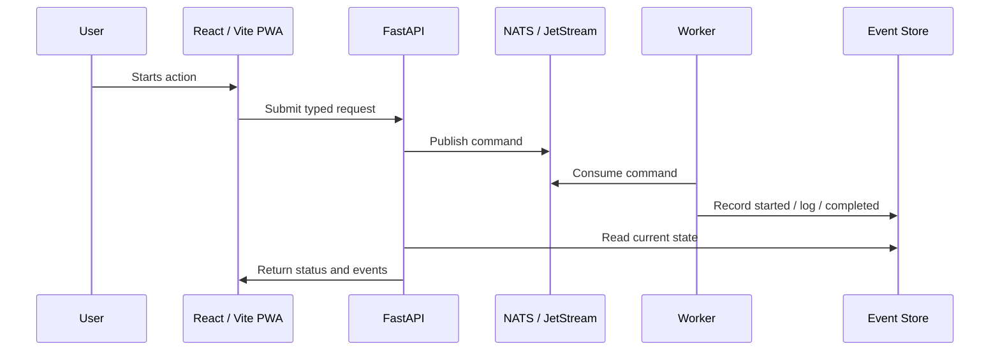

# Runtime Flow

Pocket Lab’s runtime flow is intentionally simple at the product boundary and strict at the execution boundary.

## What this means for operators

A button in the UI does not run a shell command. It creates a typed request. FastAPI validates and publishes that request. NATS / JetStream delivers it. A worker claims and executes it. Events then flow back to FastAPI and the UI.

## What this means for developers

| Rule | Reason |
| --- | --- |
| Frontend calls FastAPI only. | Keeps browser code safe and testable. |
| FastAPI publishes commands. | Keeps write paths observable and auditable. |
| Workers own execution. | Prevents UI/API shortcuts and supports resume. |
| Typed Operations define execution contracts. | Keeps frontend, backend, workers, and docs aligned. |
| Events record lifecycle state. | Enables replay, debugging, validation, and audit evidence. |

## Runtime sequence

## Explicit non-goals

- No frontend direct NATS access.
- No frontend shell execution.
- No frontend direct calls to Prometheus, Loki, Grafana, Gatus, or Promtail.
- No legacy command editor or retired update endpoint.
