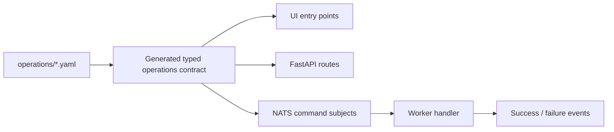

# Typed Operations Architecture

Typed Operations are Pocket Lab’s execution contract. They connect UI actions, FastAPI routes, NATS command subjects, worker handlers, lifecycle events, and generated documentation.

## Source of truth

Typed operation metadata lives in `operations/*.yaml` and is rendered into generated contracts and documentation.

Canonical references:

- [Typed Operations Catalog](../runtime/typed-operations-catalog.md)
- [Backend API Contract](../api/backend-api-contract.md)
- [NATS / JetStream Event Contract](../runtime/nats-jetstream-event-contract.md)

## Lifecycle

Typed operations prevent ad hoc shell execution and make every operation reviewable.
