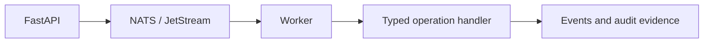

# Workers

Workers own Pocket Lab execution. They consume commands from NATS / JetStream, validate operation/runbook context, execute typed operation handlers, and emit lifecycle and audit events.

## Responsibilities

| Responsibility | Description |
| --- | --- |
| Command consumption | Claim commands from durable NATS / JetStream subjects. |
| Execution | Run typed operation handlers and bounded tool integrations. |
| Resume | Continue approved runbooks without replaying completed steps. |
| Failure handling | Emit failed events and preserve troubleshooting evidence. |
| Audit evidence | Record approval, rejection, auto-approval, and execution evidence. |

## Execution boundary

A missing worker should not cause FastAPI or the frontend to execute operations locally as a fallback.
