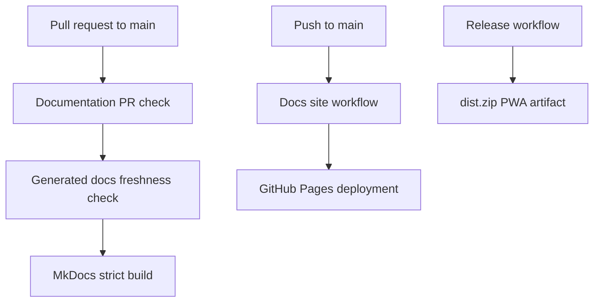

# CI/CD

Pocket Lab uses GitHub Actions to validate documentation and publish the MkDocs site, while existing release workflows build and publish PWA release artifacts.

## CI/CD model



## Workflows

The generated workflow inventory is maintained from `.github/workflows/*.yml`:

```bash
task docs:workflows
```

See [Generated GitHub Actions Workflows](generated/github-actions-workflows.md) for the current workflow list, triggers, permissions, jobs, major steps, and release artifacts.

## Required PR behavior

A documentation PR should:

1. Regenerate affected docs and contracts.
2. Build MkDocs with `--strict`.
3. Fail if generated docs are stale.
4. Avoid publishing from pull requests.

## Required main behavior

A push to `main` should:

1. Regenerate docs.
2. Build MkDocs strictly.
3. Upload the site artifact.
4. Deploy through GitHub Pages.
