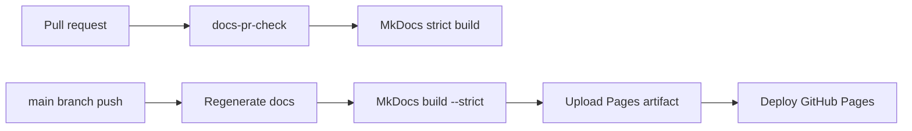

<!-- GENERATED FILE: do not edit by hand. Regenerate with `task docs:workflows`. -->

# Generated GitHub Actions Workflows

This page is generated from `.github/workflows/*.yml` and `.github/workflows/*.yaml`. It documents the workflows that validate, publish, and release Pocket Lab without changing runtime behavior.

## Summary

| Workflow | File | Classification | Triggers | Artifacts |
| --- | --- | --- | --- | --- |
| Validate MkDocs documentation | `.github/workflows/docs-pr-check.yml` | PR validation | pull_request, workflow_dispatch | docs-pr-check-debug |
| Publish MkDocs documentation site | `.github/workflows/docs-site.yml` | docs publishing | push, workflow_dispatch | GitHub Pages site artifact |
| Cut Pocket Lab release | `.github/workflows/pwa-cut-release.yml` | release automation | workflow_dispatch | dist.zip, dist.zip.sha256 |
| Build PWA release artifact | `.github/workflows/pwa-release-artifact.yml` | release automation | release, workflow_dispatch | dist.zip |

## Documentation publishing flow

## Validate MkDocs documentation

| Field | Value |
| --- | --- |
| File | `.github/workflows/docs-pr-check.yml` |
| Classification | PR validation |
| Concurrency | group: docs-pr-check-${{ github.ref }}, cancel-in-progress: true |
| Release artifacts | docs-pr-check-debug |

### Triggers

| Trigger | Details |
| --- | --- |
| `pull_request` | branches: main, paths: docs/**, mkdocs.yml, requirements-docs.txt, requirements-dev.txt, scripts/docs/**, architecture/structurizr/**, contracts/**, operations/**, runbooks/**, security/**, .github/workflows/**, Taskfile.yml, README.md |
| `workflow_dispatch` | — |

### Permissions

| Permission | Level |
| --- | --- |
| `contents` | `read` |

### Jobs and major steps

| Job | Name | Runs on | Major steps |
| --- | --- | --- | --- |
| `docs-pr-check` | Generate, validate, and check documentation freshness | `ubuntu-latest` | 1. Checkout repository — uses `actions/checkout@v4` 2. Setup Python — uses `actions/setup-python@v5` 3. Setup Node.js — uses `actions/setup-node@v4` 4. Setup Taskfile — uses `arduino/setup-task@v2` 5. Install Python dependencies — `python -m pip install --upgrade pip setuptools wheel` 6. Install Node dependencies — `npm ci` 7. Generate and validate documentation — `task docs:check` 8. Check generated documentation freshness — `git diff --exit-code -- docs/development/generated/github-actions-workflows.md` 9. Upload generated documentation on failure — uses `actions/upload-artifact@v4` |

## Publish MkDocs documentation site

| Field | Value |
| --- | --- |
| File | `.github/workflows/docs-site.yml` |
| Classification | docs publishing |
| Concurrency | group: github-pages, cancel-in-progress: false |
| Release artifacts | GitHub Pages site artifact |

### Triggers

| Trigger | Details |
| --- | --- |
| `push` | branches: main, paths: docs/**, mkdocs.yml, requirements-docs.txt, requirements-dev.txt, scripts/docs/**, architecture/structurizr/**, contracts/**, operations/**, runbooks/**, security/**, .github/workflows/**, Taskfile.yml, README.md |
| `workflow_dispatch` | — |

### Permissions

| Permission | Level |
| --- | --- |
| `contents` | `read` |
| `id-token` | `write` |
| `pages` | `write` |

### Jobs and major steps

| Job | Name | Runs on | Major steps |
| --- | --- | --- | --- |
| `build-docs` | Build MkDocs site | `ubuntu-latest` | 1. Checkout repository — uses `actions/checkout@v4` 2. Setup Python — uses `actions/setup-python@v5` 3. Setup Node.js — uses `actions/setup-node@v4` 4. Setup Taskfile — uses `arduino/setup-task@v2` 5. Install Python dependencies — `python -m pip install --upgrade pip setuptools wheel` 6. Install Node dependencies — `npm ci` 7. Configure GitHub Pages — uses `actions/configure-pages@v5` 8. Generate and validate documentation — `task docs:check` 9. Upload GitHub Pages artifact — uses `actions/upload-pages-artifact@v3` |
| `deploy-docs` | Deploy MkDocs site to GitHub Pages | `ubuntu-latest` | 1. Deploy to GitHub Pages — uses `actions/deploy-pages@v4` |

## Cut Pocket Lab release

| Field | Value |
| --- | --- |
| File | `.github/workflows/pwa-cut-release.yml` |
| Classification | release automation |
| Concurrency | group: cut-pocket-lab-release-${{ inputs.release_id }}, cancel-in-progress: false |
| Release artifacts | dist.zip, dist.zip.sha256 |

### Triggers

| Trigger | Details |
| --- | --- |
| `workflow_dispatch` | inputs: release_id: description: Release identifier, for example 2026.06.15.1, required: true, type: string, release_notes: description: Short release notes, required: false, default: Pocket Lab platform release, type: string, prerelease: description: Mark release as prerelease, required: false, default: false, type: boolean |

### Permissions

| Permission | Level |
| --- | --- |
| `contents` | `write` |

### Jobs and major steps

| Job | Name | Runs on | Major steps |
| --- | --- | --- | --- |
| `cut-pocket-lab-release` | Build, tag, and publish Pocket Lab release | `ubuntu-latest` | 1. Resolve release metadata — `release_id="${{ inputs.release_id }}"` 2. Checkout main — uses `actions/checkout@v4` 3. Verify tag does not already exist — `tag="${{ steps.meta.outputs.tag }}"` 4. Setup Node.js — uses `actions/setup-node@v4` 5. Install frontend dependencies — `npm ci` 6. Clean stale PWA output — `rm -rf dist dist.zip` 7. Build PWA — `npm run build` 8. Verify PWA dist — `test -f dist/index.html` 9. Write PWA build manifest — `cat > dist/pocketlab-pwa-build.json <<EOF_MANIFEST` 10. Create dist.zip — `zip -r dist.zip dist` 11. Create and push git tag — `tag="${{ steps.meta.outputs.tag }}"` 12. Write release notes — `cat > release-notes.md <<'EOF_NOTES'` 13. Create draft GitHub release with artifact — `tag="${{ steps.meta.outputs.tag }}"` 14. Publish GitHub release — `tag="${{ steps.meta.outputs.tag }}"` |

## Build PWA release artifact

| Field | Value |
| --- | --- |
| File | `.github/workflows/pwa-release-artifact.yml` |
| Classification | release automation |
| Concurrency | group: pwa-release-artifact-${{ github.event.release.tag_name \\|\\| inputs.tag }}, cancel-in-progress: true |
| Release artifacts | dist.zip |

### Triggers

| Trigger | Details |
| --- | --- |
| `release` | types: published |
| `workflow_dispatch` | inputs: tag: description: Existing release tag to attach dist.zip to, required: true, type: string |

### Permissions

| Permission | Level |
| --- | --- |
| `contents` | `write` |

### Jobs and major steps

| Job | Name | Runs on | Major steps |
| --- | --- | --- | --- |
| `build-pwa-release-artifact` | Build and upload dist.zip | `ubuntu-latest` | 1. Resolve release tag — `tag="${RELEASE_TAG:-${INPUT_TAG:-}}"` 2. Checkout source at release tag — uses `actions/checkout@v4` 3. Setup Node.js — uses `actions/setup-node@v4` 4. Install frontend dependencies — `npm ci` 5. Clean stale PWA output — `rm -rf dist dist.zip` 6. Build PWA — `npm run build` 7. Verify PWA dist — `test -f dist/index.html` 8. Write PWA build manifest — `cat > dist/pocketlab-pwa-build.json <<EOF_MANIFEST` 9. Create dist.zip — `rm -f dist.zip` 10. Upload dist.zip to release — `gh release upload "${{ steps.release_tag.outputs.tag }}" dist.zip \` |
