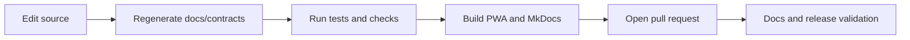

# Development Overview

Pocket Lab development is repository-driven and validation-first. The active local model is a Linux filesystem repository with Python, Node, Docker/NATS, FastAPI, workers, Vite, MkDocs, and generated documentation gates.

## Daily loop



## Key commands

```bash
task dev:up
task dev:status
task test:backend
npm run build
task docs:check
mkdocs build --strict
```

## Development references

- [Local Development](local-dev.md)
- [Testing](testing.md)
- [Debugging](debugging.md)
- [CI/CD](ci-cd.md)
- [Generated GitHub Actions Workflows](generated/github-actions-workflows.md)
