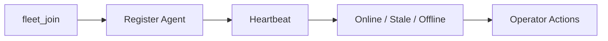

# Fleet Agent / Mesh Fleet Guide

## Purpose

This guide explains how Pocket Lab manages edge devices through Mesh Fleet.

## Core Concepts

| Concept | Meaning |
|---|---|
| Agent | Edge node reporting to Pocket Lab. |
| Role | Device function such as compute, storage, observer, or controller. |
| Heartbeat | Periodic agent status update. |
| Last seen | Timestamp of last report. |
| Stale | Agent has not reported recently. |
| Offline | Agent unavailable. |
| Join payload | Onboarding material for a new device. |

## Fleet Lifecycle



## UI States

| State | UI Behavior |
|---|---|
| Online | Agent healthy and recently seen. |
| Stale | Agent has missed heartbeat limit. |
| Offline | Agent unavailable. |
| Unknown | Agent has incomplete status. |

## Fleet Join Operation

The `fleet_join` operation creates onboarding material for an edge node. It should generate join information, avoid exposing secrets unnecessarily, associate identity with a role, emit fleet events, and display status in Mesh Fleet.

## Fleet Events

Representative event subjects:

- `pocketlab.events.fleet.joined`
- `pocketlab.events.fleet.heartbeat`
- `pocketlab.events.fleet.stale`
- `pocketlab.events.fleet.offline`

## Agent Data Example

```json
{
  "agent_id": "edge-01",
  "name": "edge-01",
  "role": "compute",
  "status": "online",
  "last_seen": "2026-06-07T00:00:00Z",
  "telemetry": {
    "cpu_usage_percent": 22,
    "memory_usage_mb": 512,
    "free_space_mb": 4096
  }
}
```

## Security

Fleet onboarding must protect join secrets, agent identity, mesh tokens, role assignment, and agent command subjects.

## Troubleshooting

| Problem | Action |
|---|---|
| Agent stale | Check network and heartbeat process. |
| Agent offline | Restart agent and verify identity. |
| Wrong role | Reissue join or update fleet metadata. |
| No telemetry | Check agent telemetry collector. |
| Join failure | Verify join payload and token validity. |

## Validation

```bash
task test:e2e
task test:faults
task test:nats-permissions
```

## Maintenance Rule

Any new fleet state, role, command subject, or event subject must update this guide and the NATS contract.
