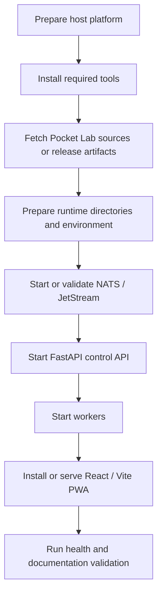

# Day 0 Bootstrap

Day 0 bootstrap prepares a Pocket Lab host before normal app operation. The exact bootstrap path depends on the platform, but the control-plane target remains the same.

## Bootstrap flow



## Platform references

Use the generated deployment and platform references for the exact scripts and environment variables present in this repository:

- [Deployment Guide](../platform/deployment-guide.md)
- [Bootstrap Scripts Reference](../platform/generated/bootstrap-scripts-reference.md)
- [Environment Variables Reference](../platform/generated/environment-reference.md)
- [Android / Termux Operations Guide](../platform/android-termux-operations-guide.md)
- [Windows WSL2 Ubuntu Bootstrap](../platform/windows-wsl2-ubuntu-bootstrap.md)

## Validation commands

```bash
task test:bootstrap
task docs:deployment:full-check
mkdocs build --strict
```

Day 0 bootstrap should prepare the environment. It should not bypass FastAPI, NATS / JetStream, workers, typed operations, or audit evidence.
