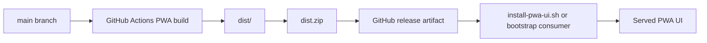

# PWA UI Installer

Pocket Lab publishes the React / Vite PWA as a release artifact so a Day 0 environment can consume a verified UI bundle without rebuilding from source on every device.

## Release artifact model

## Expected artifact contents

The release artifact should contain:

| Artifact | Purpose |
| --- | --- |
| `dist/index.html` | PWA entry point. |
| `dist/manifest.webmanifest` | Installable app metadata. |
| `dist/sw.js` | Service worker. |
| `dist/assets/` | Built JavaScript and CSS assets. |
| `dist/pocketlab-pwa-build.json` | Build metadata when produced by release workflows. |

## Operator guidance

Use the release pages for the supported flow:

- [PWA Release Artifacts](../releases/pwa-release-artifacts.md)
- [Day 0 Release Consumption](../releases/day-0-release-consumption.md)
- [Release Workflow & Upgrade Guide](../release/release-workflow-upgrade-guide.md)

Do not make the frontend responsible for release installation or shell execution. Release consumption belongs to bootstrap/runtime scripts and worker-owned operations.
