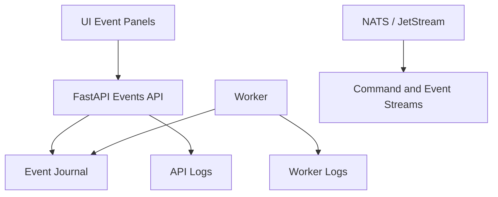

# Observability & Logging Guide

## Purpose

This guide explains Pocket Lab's observability model: event streams, audit records, logs, telemetry, and operator-facing diagnostics.

## Observability Layers



## Event Sources

| Source | Purpose |
|---|---|
| FastAPI | Accepts operations and emits control-plane events. |
| Worker | Emits operation progress and result events. |
| Health engine | Emits service health events. |
| Fleet agents | Emit heartbeat and telemetry events. |
| Release workflow | Emits release stage events. |
| Security/policy | Emits posture and guardrail events. |

## UI Event Controls

| Control | Purpose |
|---|---|
| Replay recent | Loads recent event history. |
| Clear | Clears current UI event list. |
| Reconnecting badge | Indicates WebSocket reconnection. |
| Event list | Shows recent operation, health, release, or fleet events. |

## Backend Event Interfaces

| Endpoint | Purpose |
|---|---|
| `/api/events/recent` | Recent event replay. |
| `/ws/events` | Live event stream. |
| `/api/health-engine.json` | Health snapshot. |
| `/api/nats/status` | NATS status. |
| `/api/workers/status` | Worker status. |

## Event Envelope

```json
{
  "event_id": "evt-123",
  "operation_id": "op-123",
  "correlation_id": "corr-123",
  "subject": "pocketlab.events.operation.succeeded",
  "status": "succeeded",
  "time": "2026-06-07T00:00:00Z",
  "message": "Operation completed",
  "payload": {}
}
```

## Correlation

Every write workflow should be traceable through API request, NATS command, worker logs, operation events, audit events, and UI event panels.

## Redaction

Observability must never expose tokens, passwords, API keys, Vault material, private keys, or join secrets.

Redaction applies to logs, events, audit records, DLQ messages, and UI event streams.

## Logging Guidance

| Log Type | Contents |
|---|---|
| API log | Request, route, status, correlation ID. |
| Worker log | Operation lifecycle, handler, result. |
| Event log | Structured operation state. |
| Audit log | Security-relevant actions. |
| Error log | Failure reason without secrets. |

## Troubleshooting

| Symptom | Check |
|---|---|
| Button clicked but no progress | `/api/events/recent`, NATS status, worker status. |
| Operation accepted but not completed | Worker logs and DLQ. |
| UI stream stale | WebSocket status and recent replay. |
| Release stuck | Release timeline events. |
| Fleet stale | Fleet heartbeat events. |

## Validation

```bash
task test:websockets
task test:faults
task test:redaction
task test:e2e
```

## Maintenance Rule

Any new event subject, payload field, log field, or redaction rule must update this guide and the NATS / JetStream Event Contract.
