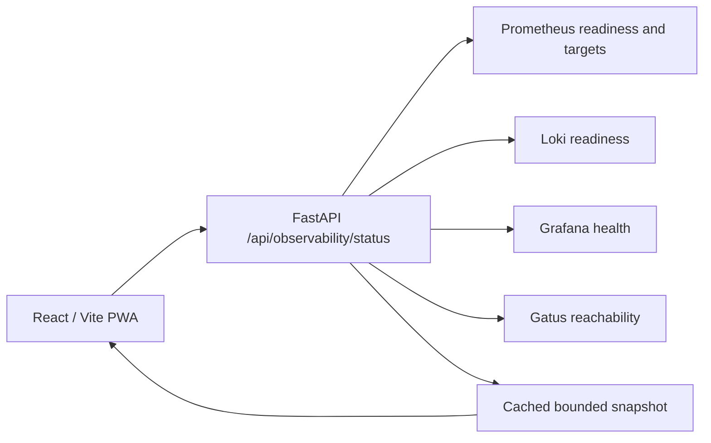

# Runtime Health

Pocket Lab exposes runtime observability status through FastAPI so the frontend does not directly call observability services.

## Runtime status path



## Status checks

| Service | Purpose |
| --- | --- |
| Prometheus | Metrics readiness and target summary. |
| Loki | Log backend readiness. |
| Promtail | Inferred log shipping from recent Loki entries. |
| Grafana | Dashboard service health. |
| Gatus | Health-check aggregator reachability. |

## Validation

```bash
task docs:observability:full-check
mkdocs build --strict
```

Live service probes are environment-dependent. Static documentation proves repository integration; runtime status proves what is reachable in the running environment.
