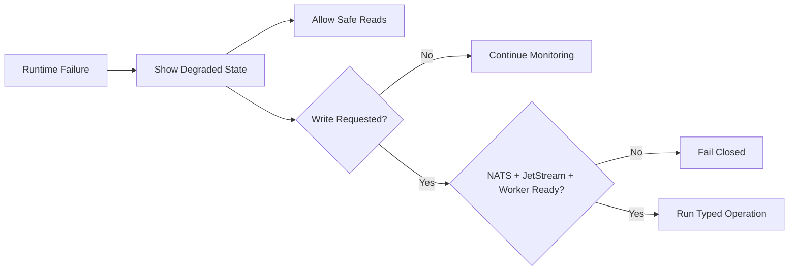

# Reliability / Degraded Mode Runbook

## Purpose

This runbook explains how Pocket Lab behaves during partial failures and how an operator should recover safely.

## Design Principle

Pocket Lab is designed to remain readable where possible while blocking unsafe writes when required infrastructure is unavailable.



## Scenario: NATS Unavailable

| Area | Behavior |
|---|---|
| UI | Shows degraded control plane. |
| API | Rejects write operations. |
| Worker | Cannot receive commands. |
| Safety | No local fallback execution. |

Recovery:

1. Restart NATS with JetStream enabled.
2. Verify `/api/nats/status`.
3. Verify `/ready`.
4. Restart worker if needed.
5. Retry the typed operation.

## Scenario: Worker Unavailable

| Area | Behavior |
|---|---|
| UI | Shows worker unavailable/degraded. |
| API | Should not allow unsafe writes. |
| NATS | Commands should not be silently executed elsewhere. |

Recovery:

```bash
task dev:status
task test:nats
```

## Scenario: JetStream Unavailable

JetStream is required for durable write workflows. If JetStream is unavailable, Pocket Lab should not accept durable write operations.

Recovery:

1. Check NATS server configuration.
2. Verify stream creation.
3. Confirm durable consumer state.
4. Restart worker and recheck readiness.

## Scenario: Vault Sealed

| Area | Behavior |
|---|---|
| UI | Identity Vault / Passwords & Access shows degraded state. |
| Backend | Secret operations fail safely. |
| Logs | No secret material is emitted. |

Recovery:

1. Unseal or recover Vault.
2. Refresh health engine state.
3. Retry secret operation only after readiness is healthy.

## Scenario: WebSocket Unavailable

The UI should reconnect or use recent event replay.

Check:

```bash
task test:websockets
```

## Scenario: Low Disk

| Area | Behavior |
|---|---|
| NOC Telemetry | Shows low disk warning. |
| Backup | May be blocked if insufficient space exists. |
| Release | Should not proceed without safe backup capacity. |

Recovery:

1. Remove stale logs or stale artifacts.
2. Verify backup destination capacity.
3. Recheck telemetry.
4. Retry operation.

## Scenario: Stale Fleet Agent

| Area | Behavior |
|---|---|
| Mesh Fleet | Shows stale/offline state. |
| Events | Last heartbeat remains available. |
| Operator | Investigates network, identity, and process health. |

## Scenario: Malformed Health or Catalog Payload

The UI should fail soft and avoid React tree crashes.

Recovery:

1. Check recent frontend/backend changes.
2. Run API contract tests.
3. Run frontend E2E tests.
4. Validate mock fixture shape.

```bash
task check:api-contract
task test:e2e
task test:faults
```

## Recovery Order

Use this order for most degraded scenarios:

1. Restore NATS / JetStream.
2. Restore FastAPI.
3. Restore worker.
4. Refresh health snapshot.
5. Replay recent events.
6. Retry typed operation.

## Validation

```bash
task test:faults
task test:websockets
task check:api-contract
```

## Maintenance Rule

Add or update a scenario whenever a new dependency, operation, event stream, fleet state, release stage, or degraded behavior is introduced.
