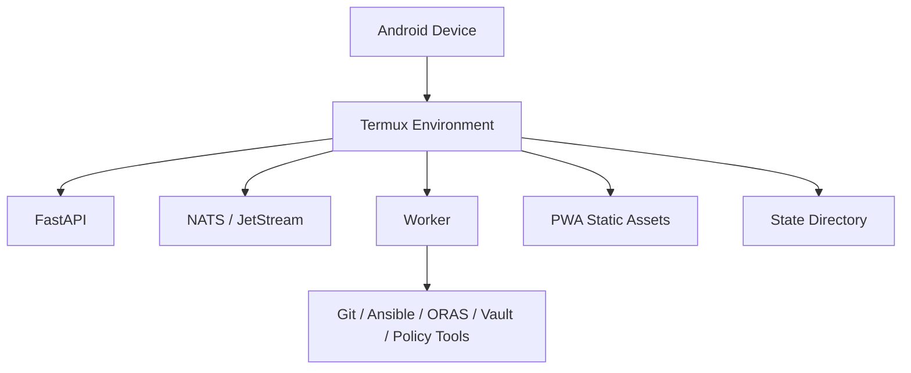

# Android / Termux Operations Guide

## Purpose

This guide explains Pocket Lab's target edge platform model for Android and Termux-style deployments.

## Platform Goals

Pocket Lab should run on constrained edge devices with ARM-friendly runtime choices, minimal heavy dependencies, restartable processes, local-first behavior, optional mesh connectivity, and clear degraded-state messaging.

## Expected Runtime Shape



## Service Startup

Recommended order:

1. NATS / JetStream
2. FastAPI
3. Worker
4. PWA/static frontend
5. Optional fleet agent
6. Optional observability components

## Operator Access

| Component | Access |
|---|---|
| PWA | Browser URL |
| FastAPI | Local API port |
| NATS | Local service only |
| Logs | Termux filesystem or process logs |
| State | Pocket Lab state directory |

## Android Smoke Gate

```bash
task android:smoke
```

This should verify that required commands exist, runtime directories are writable, NATS can start, FastAPI can start, the worker can connect, API health works, PWA assets can be served, and storage/permissions are acceptable.

## Platform Constraints

| Constraint | Guidance |
|---|---|
| Limited memory | Avoid heavy background services. |
| Mobile storage | Monitor disk usage and backup growth. |
| Process lifecycle | Use restartable process supervision. |
| Network changes | Expect IP and connectivity changes. |
| Battery limits | Avoid unnecessary polling. |
| Native dependencies | Prefer ARM-friendly and pure-Python where possible. |

## Troubleshooting

| Issue | Action |
|---|---|
| API not reachable | Check FastAPI process and port binding. |
| NATS unavailable | Restart NATS and verify JetStream. |
| Worker disconnected | Check NATS URL and worker logs. |
| UI stale | Refresh PWA and check API status. |
| Low disk | Clean logs/backups and verify state. |
| Permission denied | Check Termux storage and executable permissions. |

## Safety

Android/Termux deployments must preserve the same fail-closed model as Linux deployments. The worker must not be bypassed for local shell execution.
