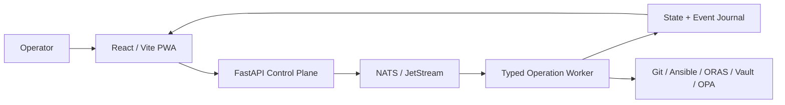

# Pocket Lab Product Overview / Operator Guide

## Purpose

Pocket Lab is an edge-first, self-hosted control-plane and lab orchestration platform for constrained environments such as Android/Termux, small Linux nodes, home labs, portable security labs, and edge devices.

The app gives an operator a browser-based interface to manage Apps and Services, GitOps synchronization, Blueprint deployment, Drift detection, Fleet devices, Vault and secrets workflows, Security Posture, NOC telemetry, Backup and Restore, Release updates, and event/audit visibility.

## Runtime Model

Pocket Lab is built around four core layers:

The UI does not execute local commands directly. User actions become typed operations. FastAPI validates and accepts the request, NATS / JetStream persists the command, and the worker executes the operation.

## User Modes

Pocket Lab supports both non-technical and technical operators.

| Professional Mode | Simple Mode |
|---|---|
| App Catalog | Apps & Services |
| GitOps Pipeline | Keep My Environment Updated |
| Drift Center | Health & Issues |
| Mesh Fleet | My Devices |
| Identity Vault | Passwords & Access |
| Security Posture | Safety Center |
| NOC Telemetry | System Status |

Simple Mode keeps the same backend behavior but changes labels and explanations so non-technical users can safely operate the platform.

## Core Operator Workflows

### Refresh Apps and Services

1. Open **App Catalog** or **Apps & Services**.
2. Click **Refresh catalog**.
3. Pocket Lab submits a typed `catalog_refresh` operation.
4. FastAPI publishes a command through NATS / JetStream.
5. The worker refreshes catalog state and emits operation events.
6. The UI updates status using live events or recent event replay.

### Install or Deploy an App

1. Open **App Catalog**.
2. Select repository, OCI artifact, ZIP, HTTP/HTTPS, or local source mode.
3. Select the blueprint/app reference.
4. Click **Deploy Workload** or **Install**.
5. Pocket Lab submits `deploy_blueprint`.
6. Progress appears in the operation panel.

### Check System Status

1. Open **NOC Telemetry** or **System Status**.
2. Review API, NATS, worker, health engine, CPU, memory, disk, fleet, and event state.
3. If degraded, use the degraded-mode runbook before running write operations.

### Apply a Release

1. Open **Release Workflow**.
2. Click **Check release**.
3. Review current and target release state.
4. Click **Apply latest** only if the control plane is healthy.
5. Pocket Lab runs backup, sync, deploy, verify, and catalog refresh stages.

### Respond to Drift

1. Open **Drift Center**.
2. Review detected differences between desired and actual state.
3. Decide whether to rescan, preview, approve, apply, or ignore.
4. Use operation history and events to verify the outcome.

## Safety Behavior

Pocket Lab avoids hidden or unsafe fallbacks.

| Condition | Expected Behavior |
|---|---|
| NATS unavailable | Write actions fail closed. |
| JetStream unavailable | Durable writes are blocked. |
| Worker unavailable | Operations are not executed locally as a fallback. |
| Vault sealed | Secrets workflows show degraded state. |
| WebSocket unavailable | UI falls back to recent events where supported. |
| Malformed data | UI fails soft instead of crashing. |
| Retired operation path | Build/test gates should reject it. |

## Operator Do / Do Not

Operators should:

- Use typed UI actions instead of direct state edits.
- Review degraded banners before write operations.
- Validate release readiness before applying updates.
- Verify backups before risky changes.
- Use event history to troubleshoot failures.

Operators should not:

- Bypass FastAPI and NATS for writes.
- Reintroduce retired operation names.
- Call internal service APIs directly from the frontend.
- Store plaintext secrets in docs, logs, events, or backup manifests.
- Ignore failed release or restore stages.

## Related Docs

- [Screen-by-Screen UI/UX Manual](ui-screen-reference.md)
- [Backend API Contract](../api/backend-api-contract.md)
- [NATS / JetStream Event Contract](../runtime/nats-jetstream-event-contract.md)
- [Typed Operations Catalog](../runtime/typed-operations-catalog.md)
- [Degraded Mode Runbook](../operations/degraded-mode-runbook.md)
