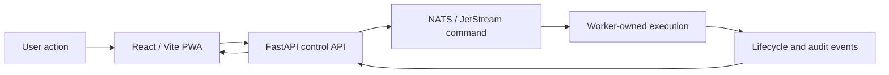

# Product Overview

Pocket Lab is a local control-plane app for installing, maintaining, observing, and recovering self-hosted services in constrained or edge-first environments.

It is designed for users who want a friendly UI while preserving enterprise-grade execution boundaries, auditability, and generated evidence.

## Core capabilities

| Capability | Purpose |
| --- | --- |
| Apps & Services / Blueprint Catalog | Install or manage app blueprints from repository, local, HTTP, ZIP, or OCI-style sources. |
| Keep My Environment Updated / GitOps | Keep the local environment aligned with a trusted source. |
| Health & Issues / Drift Center | Detect and review differences between desired and actual state. |
| My Devices / Fleet Scaling | Add and monitor devices in a mesh-style fleet. |
| Passwords & Access / Identity & Vault | Rotate and manage secrets through governed operations. |
| Safety Center / Security Posture | Review policy, threat-model, and security evidence. |
| System Status / NOC Telemetry | Understand API, worker, event, telemetry, and observability health. |
| Disaster Recovery | Verify backups, preview restore, and recover safely. |
| Release Workflow | Check, verify, and consume published PWA release artifacts. |

## Product principles

Pocket Lab keeps product actions friendly while preserving strict runtime ownership:

The UI launches typed operations. Workers own execution and resume. Generated evidence documents the contract between product behavior and runtime behavior.

## Experience modes

Pocket Lab separates experience language from governance strictness:

| Mode | Audience | Behavior |
| --- | --- | --- |
| Simple | Non-technical/self-hosted users | Friendly labels and safer explanations. |
| Professional | Operators and developers | Clear control-plane and operation wording. |
| Enterprise | Organizations and reviewers | Strict governance, approval evidence, and audit framing. |

Personal governance can auto-approve safe eligible operations with audit evidence. Enterprise governance remains opt-in and requires human approval for governed runbooks.
