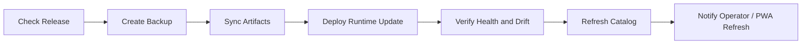
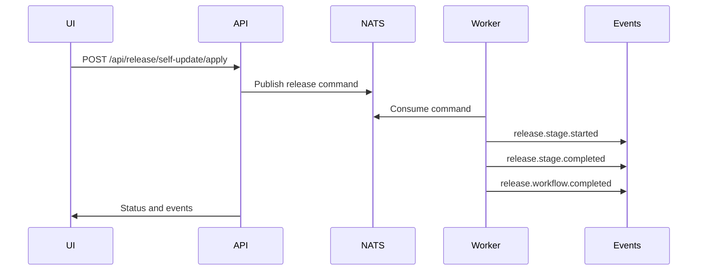

# Release Workflow & Upgrade Guide

## Purpose

This guide explains how Pocket Lab checks, applies, verifies, and recovers from releases.

## Release Flow



## User-Facing Controls

| Control | Purpose |
|---|---|
| Check release | Checks whether a newer release exists. |
| Apply latest | Starts release apply workflow. |
| Release timeline | Shows stage progress and failures. |
| Current/target version | Displays installed and available release state. |
| Health status | Indicates whether the environment is safe to update. |

## Release Stages

| Stage | Related Operation | Purpose |
|---|---|---|
| Prepare | `release_prepare`, `backup_now` | Create safety backup and prepare state. |
| Sync | `release_sync`, `git_sync` | Sync release source or artifact. |
| Deploy | `release_deploy`, `deploy_blueprint` | Apply runtime update. |
| Verify | `release_verify`, `drift_scan` | Confirm expected state. |
| Catalog refresh | `catalog_refresh` | Refresh Apps & Services state. |

## Backend Sequence



## Required Safety Rules

- Backup must occur before apply.
- Writes must use typed operations.
- Retired paths must not be reintroduced.
- Events must be persisted for replay.
- Failed stages must be visible in the UI.
- Rollback must be possible from a verified backup.
- Catalog should refresh after successful release.

## Release Dry Run

Before tagging or publishing:

```bash
task release:dry-run
```

The dry run should validate build artifacts, release metadata, PWA output, backend package readiness, documentation build, and required release files.

## Failure Recovery

| Failure | Recovery |
|---|---|
| Check failed | Verify release source and network. |
| Backup failed | Stop release; fix backup first. |
| Sync failed | Check Git or artifact source. |
| Deploy failed | Inspect logs and restore backup if needed. |
| Verify failed | Treat as drift or partial update. |
| Catalog refresh failed | Retry after control plane is healthy. |

## Rollback Guidance

Rollback should use:

1. Last verified backup.
2. Release event timeline.
3. Restore operation.
4. Drift scan.
5. Catalog refresh.
6. Health verification.

## Maintenance Rule

Any change to release stages, route names, event names, backup behavior, or UI release controls must update this guide and the Typed Operations Catalog.
