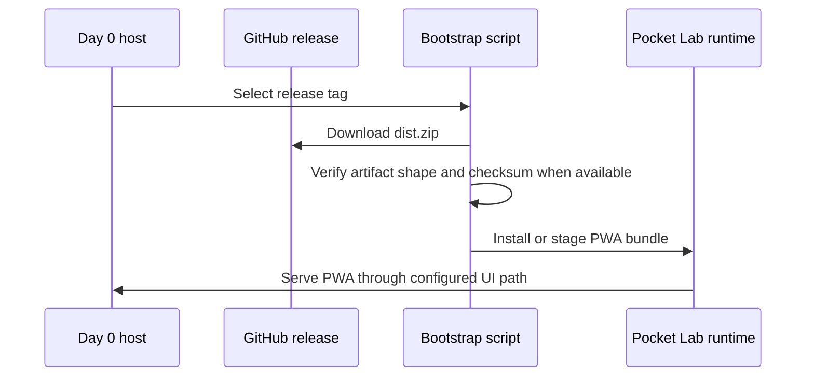

# Day 0 Release Consumption

Day 0 release consumption lets a fresh Pocket Lab environment install or update the UI from a published release artifact.

## Consumption flow

## Operator checklist

1. Choose a trusted release tag.
2. Download `dist.zip` and checksum evidence when available.
3. Verify the artifact contains `dist/index.html`, `dist/manifest.webmanifest`, `dist/sw.js`, and `dist/assets/`.
4. Install or stage the artifact using the documented bootstrap path.
5. Validate FastAPI, NATS / JetStream, worker, and UI health after the update.

Release consumption should not move execution into the frontend. The PWA remains the user interface; FastAPI, NATS / JetStream, workers, and typed operations remain the runtime execution path.
