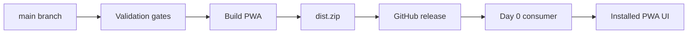

# Releases Overview

Pocket Lab releases provide source and PWA artifacts that operators can verify, consume, and roll back safely.

## Release model

## Release documentation

- [PWA Release Artifacts](pwa-release-artifacts.md)
- [Release Tags](release-tags.md)
- [Day 0 Release Consumption](day-0-release-consumption.md)
- [Release Workflow & Upgrade Guide](../release/release-workflow-upgrade-guide.md)

## Safety expectations

Release automation should validate artifacts, preserve source commit evidence, and avoid hidden runtime shortcuts. Runtime updates should remain observable through typed operations, stage events, health checks, and rollback guidance.
