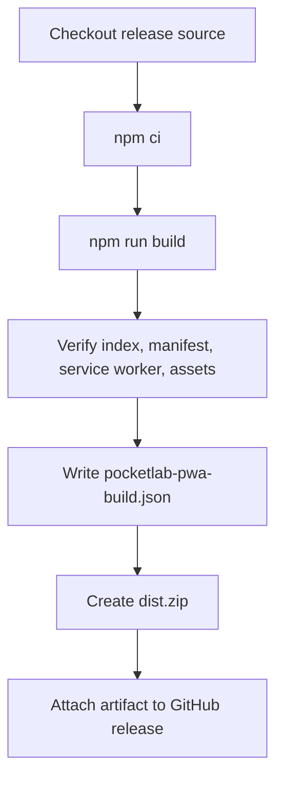

# PWA Release Artifacts

Pocket Lab’s PWA release artifact is the built React / Vite UI packaged as `dist.zip`.

## Artifact creation flow



## Expected contents

| Path | Purpose |
| --- | --- |
| `dist/index.html` | Browser entry point. |
| `dist/manifest.webmanifest` | Installable PWA metadata. |
| `dist/sw.js` | Service worker. |
| `dist/assets/` | Compiled JavaScript and CSS. |
| `dist/pocketlab-pwa-build.json` | Release metadata when generated by the release workflow. |

## Validation

```bash
npm run build
test -f dist/index.html
test -f dist/manifest.webmanifest
test -f dist/sw.js
test -d dist/assets
```

Release workflows may also produce `dist.zip.sha256` for checksum verification.
