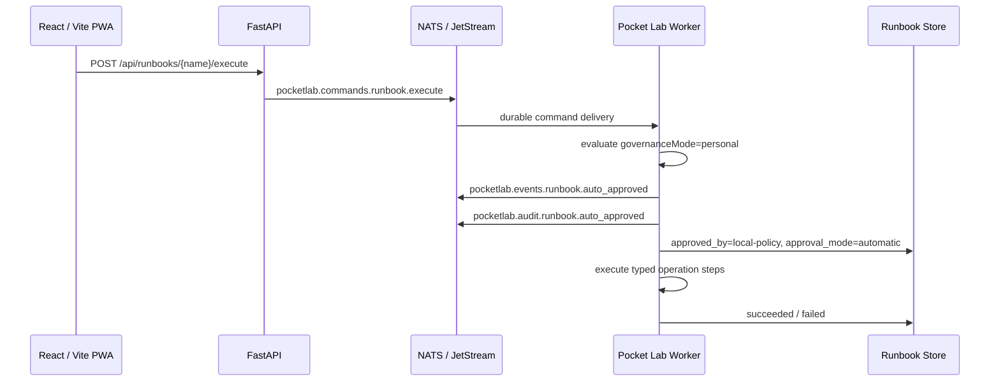
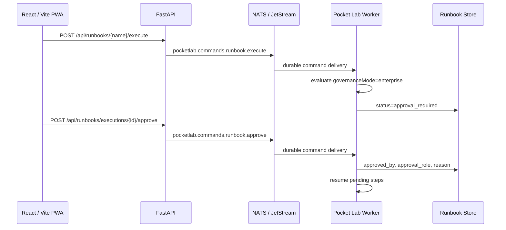

# Adaptive Approval Policies and Enterprise Mode

!!! note "Default public GitHub / self-hosted behavior"
    Pocket Lab defaults to Personal Mode. Approval-gated runbooks are auto-approved by local policy and fully logged so home-lab and self-hosted users are not blocked by enterprise-style approval prompts.

## Why this exists

Tier 7E introduced governed approval and resume. Tier 7F makes that governance adaptive:

- Personal Mode: auto-approve approval-gated runbooks and log evidence.
- Enterprise Mode: pause approval-gated runbooks until an authorized role approves or rejects them.

This keeps Pocket Lab friendly for public GitHub installs while preserving the governed operations platform for opt-in enterprise use.

## Runtime flow in Personal Mode



## Runtime flow in Enterprise Mode



## API

| Endpoint | Purpose |
|---|---|
| `GET /api/settings/governance` | Read effective governance mode. |
| `PUT /api/settings/governance` | Set `personal` or `enterprise` governance mode. |
| `POST /api/runbooks/executions/{execution_id}/approve` | Enterprise Mode approval. |
| `POST /api/runbooks/executions/{execution_id}/reject` | Enterprise Mode rejection. |

## Mode behavior

| Mode | Behavior |
|---|---|
| Personal | Default. Auto-approves approval-gated runbooks as `local-policy` and emits audit evidence. |
| Enterprise | Opt-in. Keeps role-based human approval gates enforced. |

## Environment override

Operators can force mode without UI state:

```bash
POCKETLAB_GOVERNANCE_MODE=enterprise
```

Allowed values:

```text
personal
enterprise
```
