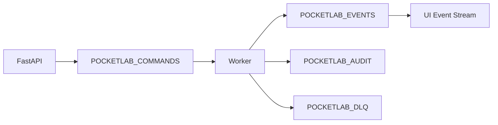

# NATS / JetStream Event Contract

!!! note "Generated page"
    This page is generated from the AsyncAPI contract. Do not manually edit subject lists here. Update `scripts/docs/generate_asyncapi_contract.py`, then run `task docs:events`.

## Source of Truth

| Item | Value |
|---|---|
| AsyncAPI contract | `contracts/asyncapi/pocketlab-nats-jetstream.yaml` |
| Interactive AsyncAPI viewer | [Open interactive AsyncAPI viewer](generated/nats-jetstream-asyncapi/index.html) |
| Protocol | `nats` |
| Runtime | NATS / JetStream |
| Version | `2.3.0-phase12` |

## Runtime Model

Pocket Lab uses NATS and JetStream as its durable command and event backbone.



## Command Subjects

| Subject | Type |
|---|---|
| `pocketlab.commands.catalog.refresh` | Command |
| `pocketlab.commands.drift.scan` | Command |
| `pocketlab.commands.fleet.join` | Command |
| `pocketlab.commands.health.check` | Command |
| `pocketlab.commands.operation.execute` | Command |
| `pocketlab.commands.release.apply` | Command |
| `pocketlab.commands.release.check` | Command |
| `pocketlab.commands.runbook.approve` | Command |
| `pocketlab.commands.runbook.execute` | Command |
| `pocketlab.commands.runbook.reject` | Command |
| `pocketlab.commands.security.scan` | Command |
| `pocketlab.commands.vault.dynamic_secret` | Command |
| `pocketlab.commands.vault.rotate` | Command |

## Event Subjects

| Subject | Type |
|---|---|
| `pocketlab.events.catalog.refreshed` | Event |
| `pocketlab.events.command.dead_lettered` | Event |
| `pocketlab.events.command.failed` | Event |
| `pocketlab.events.command.queued` | Event |
| `pocketlab.events.command.retry_scheduled` | Event |
| `pocketlab.events.command.succeeded` | Event |
| `pocketlab.events.drift.detected` | Event |
| `pocketlab.events.fleet.node_heartbeat` | Event |
| `pocketlab.events.fleet.node_telemetry` | Event |
| `pocketlab.events.health.checked` | Event |
| `pocketlab.events.operation.created` | Event |
| `pocketlab.events.operation.failed` | Event |
| `pocketlab.events.operation.log` | Event |
| `pocketlab.events.operation.succeeded` | Event |
| `pocketlab.events.operation.worker_claimed` | Event |
| `pocketlab.events.release.stage.completed` | Event |
| `pocketlab.events.release.workflow.completed` | Event |
| `pocketlab.events.release.workflow.started` | Event |
| `pocketlab.events.runbook.approval_queued` | Event |
| `pocketlab.events.runbook.approval_required` | Event |
| `pocketlab.events.runbook.approved` | Event |
| `pocketlab.events.runbook.failed` | Event |
| `pocketlab.events.runbook.queued` | Event |
| `pocketlab.events.runbook.rejected` | Event |
| `pocketlab.events.runbook.rejection_queued` | Event |
| `pocketlab.events.runbook.resumed` | Event |
| `pocketlab.events.runbook.started` | Event |
| `pocketlab.events.runbook.step_failed` | Event |
| `pocketlab.events.runbook.step_started` | Event |
| `pocketlab.events.runbook.step_succeeded` | Event |
| `pocketlab.events.runbook.succeeded` | Event |
| `pocketlab.events.security.finding` | Event |
| `pocketlab.events.telemetry.sampled` | Event |
| `pocketlab.events.vault.secret_rotated` | Event |
| `pocketlab.events.worker.heartbeat` | Event |
| `pocketlab.events.workflow.recovery_completed` | Event |

## Audit Subjects

| Subject | Type |
|---|---|
| `pocketlab.audit.release.applied` | Audit |
| `pocketlab.audit.runbook.approved` | Audit |
| `pocketlab.audit.runbook.executed` | Audit |
| `pocketlab.audit.runbook.rejected` | Audit |
| `pocketlab.audit.security.policy_updated` | Audit |
| `pocketlab.audit.vault.secret_rotated` | Audit |

## Dead Letter Subjects

| Subject | Type |
|---|---|
| `pocketlab.dlq.original_subject` | DLQ |

## JetStream Streams

| Stream | Subjects |
|---|---|
| `POCKETLAB_COMMANDS` | `pocketlab.commands.>` |
| `POCKETLAB_EVENTS` | `pocketlab.events.>` |
| `POCKETLAB_AUDIT` | `pocketlab.audit.>` |
| `POCKETLAB_DLQ` | `pocketlab.dlq.>` |

## Retry and DLQ Policy

| Setting | Value |
|---|---|
| `max_deliver` | `5` |
| `ack_wait_seconds` | `60` |
| `retry_base_seconds` | `5` |
| `retry_max_seconds` | `300` |

## Redaction Policy

| Sensitive Key Pattern |
|---|
| `token` |
| `password` |
| `secret` |
| `api_key` |
| `authorization` |
| `private_key` |
| `value` |

## Payload Envelopes

The AsyncAPI contract defines these common payload envelopes:

| Schema | Purpose |
|---|---|
| `CommandEnvelope` | Durable command submitted by FastAPI and consumed by workers. |
| `EventEnvelope` | Runtime event emitted for UI updates, recovery, auditability, and observability. |
| `DeadLetterEnvelope` | Failed command record after retry exhaustion. |

## Governance Rules

- Every durable write operation must publish a typed command.
- Every worker action must emit operation lifecycle events.
- Sensitive values must be redacted before events, audit records, logs, and DLQ payloads.
- Fleet commands must remain scoped to the intended agent/node.
- Any new command, event, audit, telemetry, or DLQ subject must update the AsyncAPI generator.
- `task docs:events` must pass before event-contract documentation is considered fresh.

## Regenerate

```bash
task docs:events
task docs:build
```
