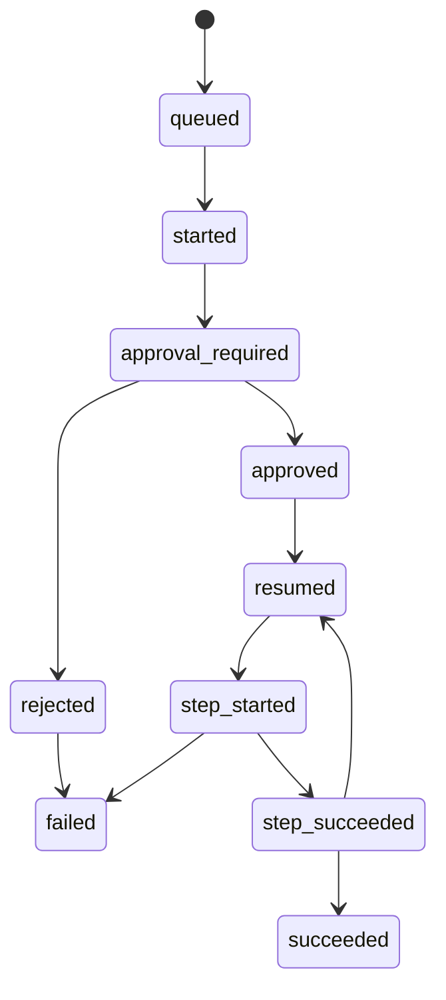

# Runbook Approval and Resume Lifecycle

!!! note "Tier 7E native runbook workflow"
    This page documents Pocket Lab's native runbook approval and controlled resume workflow. FastAPI remains the control API. NATS / JetStream remains the command and event backbone. Workers remain the execution owner. The frontend never talks directly to NATS.

## Lifecycle

## Control API

| Endpoint | Purpose |
|---|---|
| `POST /api/runbooks/{name}/execute` | Queue a runbook execution. |
| `POST /api/runbooks/executions/{execution_id}/approve` | Approve and resume an approval-gated runbook. |
| `POST /api/runbooks/executions/{execution_id}/reject` | Reject and fail an approval-gated runbook. |
| `GET /api/runbooks/executions/{execution_id}` | Inspect execution state, steps, and event journal. |

## NATS / JetStream Commands

| Subject | Purpose |
|---|---|
| `pocketlab.commands.runbook.execute` | Worker-owned runbook execution. |
| `pocketlab.commands.runbook.approve` | Worker-owned approval and resume. |
| `pocketlab.commands.runbook.reject` | Worker-owned rejection and failure projection. |

## Events and Audit Evidence

| Subject | Purpose |
|---|---|
| `pocketlab.events.runbook.approved` | Approval lifecycle event. |
| `pocketlab.events.runbook.rejected` | Rejection lifecycle event. |
| `pocketlab.events.runbook.resumed` | Resume lifecycle event. |
| `pocketlab.audit.runbook.approved` | Approval audit evidence. |
| `pocketlab.audit.runbook.rejected` | Rejection audit evidence. |

## Safety Rules

- Runbooks orchestrate typed operations only.
- Approval and rejection are submitted through FastAPI and NATS / JetStream.
- Workers own execution and resume behavior.
- Completed steps are not replayed during resume.
- Rejection does not execute additional steps.
- Approval metadata is written to execution state and emitted to audit subjects.
