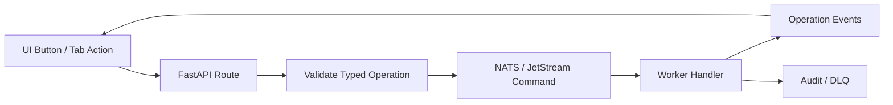

# Typed Operations Catalog

!!! note "Generated page"
    This page is generated from the Pocket Lab typed operations contract. Do not manually edit operation lists here. Update `scripts/docs/generate_operations_contract.py`, then run `task docs:operations`.

## Source of Truth

| Item | Value |
|---|---|
| Operations contract | `contracts/operations/pocketlab-typed-operations.json` |
| Interactive viewer | [Open interactive operations catalog](generated/typed-operations-catalog/index.html) |
| Operation count | `19` |
| Architecture | FastAPI + NATS / JetStream + Worker + Event-Sourced Workflow Engine |

## Runtime Model

Pocket Lab uses typed operations as the safe boundary between the UI, FastAPI, NATS / JetStream, workers, runtime tools, event sourcing, and audit trails.



## Operation Index

| Operation | Professional Label | Simple Label | NATS Subject |
|---|---|---|---|
| `backup_now` | Backup now | Save a copy | `pocketlab.commands.operation.execute` |
| `backup_verify` | Verify backup | Check saved copy | `pocketlab.commands.operation.execute` |
| `catalog_refresh` | Refresh catalog | Update app list | `pocketlab.commands.catalog.refresh` |
| `configure_opa` | Configure OPA | Update safety rules | `pocketlab.commands.security.configure_opa` |
| `deploy_blueprint` | Deploy Workload | Install | `pocketlab.commands.operation.execute` |
| `drift_apply` | Apply remediation | Fix issue | `pocketlab.commands.drift.apply` |
| `drift_approve` | Approve remediation | Approve fix | `pocketlab.commands.drift.approve` |
| `drift_ignore` | Ignore finding | Ignore this change | `pocketlab.commands.drift.ignore` |
| `drift_preview` | Preview remediation | Preview fix | `pocketlab.commands.drift.preview` |
| `drift_scan` | Run drift scan | Check what changed | `pocketlab.commands.drift.scan` |
| `fleet_join` | Join Fleet | Add Device | `pocketlab.commands.fleet.join` |
| `git_sync` | Sync GitOps | Keep my environment updated | `pocketlab.commands.operation.execute` |
| `health_check` | Refresh health snapshot | Check system health | `pocketlab.commands.health.check` |
| `release_apply` | Apply latest | Update now | `pocketlab.commands.release.apply` |
| `release_check` | Check release | Check for update | `pocketlab.commands.release.check` |
| `restore_backup` | Restore backup | Restore saved copy | `pocketlab.commands.operation.execute` |
| `rotate_secret` | Rotate Secret | Change Password | `pocketlab.commands.vault.rotate` |
| `secret_read_dynamic` | Read dynamic secret | Get temporary password | `pocketlab.commands.vault.dynamic_secret` |
| `security_scan` | Run security scan | Check safety | `pocketlab.commands.security.scan` |

## Screen-to-Operation Mapping

| Screen / Tab | Operations |
|---|---|
| App Catalog | `catalog_refresh`, `deploy_blueprint` |
| Apps & Services | `catalog_refresh`, `deploy_blueprint` |
| Blueprint Registry | `deploy_blueprint` |
| Disaster Recovery | `backup_now`, `backup_verify`, `restore_backup` |
| Drift Center | `drift_apply`, `drift_approve`, `drift_ignore`, `drift_preview`, `drift_scan` |
| GitOps Pipeline | `git_sync` |
| Health & Issues | `drift_scan` |
| Health Engine | `health_check` |
| Identity Vault | `rotate_secret`, `secret_read_dynamic` |
| Keep My Environment Updated | `git_sync` |
| Mesh Fleet | `fleet_join` |
| My Devices | `fleet_join` |
| NOC Telemetry | `health_check` |
| Passwords & Access | `rotate_secret`, `secret_read_dynamic` |
| Policy Guardrails | `configure_opa` |
| Release Workflow | `backup_now`, `catalog_refresh`, `release_apply`, `release_check` |
| Safety Center | `configure_opa`, `security_scan` |
| Security Posture | `security_scan` |
| System Status | `health_check` |

## API-to-Operation Mapping

| API Path | Operations |
|---|---|
| `/api/catalog/refresh` | `catalog_refresh` |
| `/api/health/check` | `health_check` |
| `/api/operations/execute` | `backup_now`, `backup_verify`, `catalog_refresh`, `configure_opa`, `deploy_blueprint`, `drift_apply`, `drift_approve`, `drift_ignore`, `drift_preview`, `drift_scan`, `fleet_join`, `git_sync`, `restore_backup`, `rotate_secret`, `secret_read_dynamic` |
| `/api/operations/preview` | `drift_preview`, `restore_backup` |
| `/api/release/self-update/apply` | `release_apply` |
| `/api/release/self-update/check` | `release_check` |
| `/api/security/scan` | `security_scan` |

## NATS Subject Mapping

| NATS Subject | Operations |
|---|---|
| `pocketlab.commands.catalog.refresh` | `catalog_refresh` |
| `pocketlab.commands.drift.apply` | `drift_apply` |
| `pocketlab.commands.drift.approve` | `drift_approve` |
| `pocketlab.commands.drift.ignore` | `drift_ignore` |
| `pocketlab.commands.drift.preview` | `drift_preview` |
| `pocketlab.commands.drift.scan` | `drift_scan` |
| `pocketlab.commands.fleet.join` | `fleet_join` |
| `pocketlab.commands.health.check` | `health_check` |
| `pocketlab.commands.operation.execute` | `backup_now`, `backup_verify`, `deploy_blueprint`, `git_sync`, `restore_backup` |
| `pocketlab.commands.release.apply` | `release_apply` |
| `pocketlab.commands.release.check` | `release_check` |
| `pocketlab.commands.security.configure_opa` | `configure_opa` |
| `pocketlab.commands.security.scan` | `security_scan` |
| `pocketlab.commands.vault.dynamic_secret` | `secret_read_dynamic` |
| `pocketlab.commands.vault.rotate` | `rotate_secret` |

## Safety Behavior

| Operation | Safety Behavior |
|---|---|
| `backup_now` | Must verify destination space and redact sensitive data. |
| `backup_verify` | Read/verification workflow. Should not mutate runtime state. |
| `catalog_refresh` | Write action. Requires FastAPI, NATS, JetStream, and worker readiness. Fails closed when degraded. |
| `configure_opa` | Policy mutation. Must be auditable and recoverable. |
| `deploy_blueprint` | Privileged write action. Must remain typed, auditable, and policy-guarded. |
| `drift_apply` | Write action. Requires healthy control plane and prior approval. |
| `drift_approve` | Approval action. Must be auditable. |
| `drift_ignore` | State mutation. Must be auditable. |
| `drift_preview` | Preview-only. Must not mutate runtime state. |
| `drift_scan` | Read/analysis workflow. Remediation must be a separate typed write operation. |
| `fleet_join` | Sensitive onboarding action. Join secrets must be redacted. |
| `git_sync` | Must not reintroduce retired sync shell compatibility paths. |
| `health_check` | Operational check. Should be safe to run repeatedly. |
| `release_apply` | High-impact write. Must backup before apply and fail closed when degraded. |
| `release_check` | Read/check workflow. Must not apply changes. |
| `restore_backup` | Destructive write. Requires preview, confirmation, and healthy control plane. |
| `rotate_secret` | High sensitivity. Secret values must never appear in logs/events. |
| `secret_read_dynamic` | Lease values must be redacted and not persisted in UI-visible events. |
| `security_scan` | Scan workflow. Must redact findings containing secrets. |

## Forbidden / Retired Patterns

These patterns must not be reintroduced:

- `legacy_intent`
- `sync_bash`
- `tofu_deploy`
- `/api/action/update`
- `dashboard_api`

## Operation Governance Rules

- Every UI write action must map to a typed operation.
- Every typed operation must have a documented UI entry point.
- Every typed operation must have an API entry point.
- Every durable operation must map to a NATS command subject.
- Every operation must document success and failure events.
- Sensitive operations must document redaction and fail-closed behavior.
- Retired compatibility operations must not reappear.
- `task docs:operations` must pass before operation docs are considered fresh.

## Regenerate

```bash
task docs:operations
task docs:build
```
