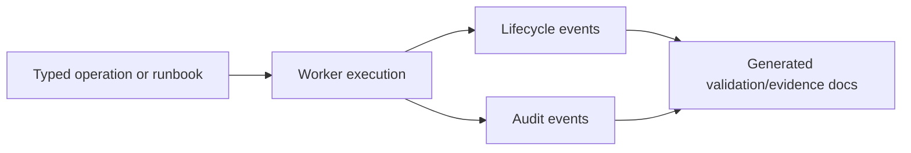

# Audit Evidence

Pocket Lab records operational evidence through lifecycle events, audit events, generated validation evidence, runbook matrices, and release artifacts.

## Evidence sources

| Source | Evidence |
| --- | --- |
| Operation events | Created, queued, worker-claimed, log, succeeded, failed, and degraded events. |
| Runbook events | Started, approval-required, approved, rejected, resumed, auto-approved, succeeded, failed. |
| Policy evidence | Operation-to-policy and runbook-to-policy mapping. |
| Validation evidence | Release readiness, command results, UI evidence, and Allure-compatible results. |
| Release evidence | Release tag, source commit, PWA artifact, checksum, and build metadata. |

## Evidence flow

Evidence should be generated from repository or runtime sources, not manually invented.
