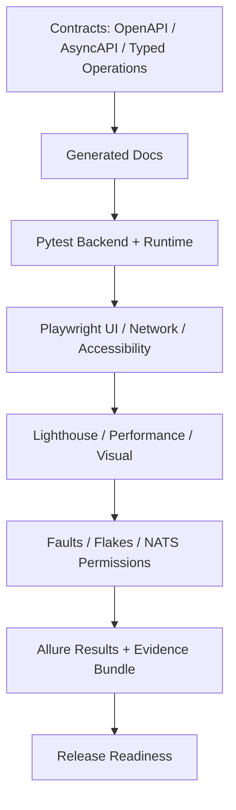

# Test Strategy & Quality Gates Guide

!!! note "Generated Tier 8 test strategy"
    This guide is generated from the Tier 8 validation gate catalog. Update `scripts/docs/validation_evidence_lib.py` when a gate is added, removed, or changes scope.

## Strategy



## Gate Catalog

| Gate | Category | Owner | Command | Blocking | Coverage |
|---|---|---|---|---|---|
| `docs-api` OpenAPI backend contract | Contract | Backend | `task docs:api` | yes | FastAPI route contract<br>Redocly API lint<br>frontend/backend integration evidence |
| `docs-events` NATS / JetStream AsyncAPI contract | Contract | Runtime | `task docs:events` | yes | NATS subjects<br>JetStream streams<br>audit and DLQ events |
| `docs-operations` Typed Operations catalog | Contract | Runtime | `task docs:operations` | yes | typed operation registry<br>UI entrypoints<br>NATS subjects<br>operation safety metadata |
| `docs-architecture` Structurizr architecture-as-code | Architecture | Architecture | `task docs:architecture` | yes | C4 workspace<br>security-review views<br>runtime flow diagrams |
| `docs-threat-model` Threat model validation | Security | Security | `task docs:threat-model:check` | yes | threat metadata<br>drift evidence<br>source synchronization evidence |
| `docs-runbooks` Runbook catalog, docs, and validation gates | Operations | Operations | `task docs:runbooks:full-check` | yes | native runbooks<br>approval metadata<br>evidence matrix<br>typed operation mapping |
| `mkdocs-build` MkDocs strict documentation build | Documentation | Docs | `mkdocs build --strict` | yes | documentation navigation<br>generated pages<br>strict link validation |
| `pytest-backend` Backend pytest evidence | Test | Backend | `task test:backend` | yes | FastAPI routes<br>runtime services<br>runbook engine<br>state and reliability tests |
| `pytest-performance` Performance smoke pytest evidence | Performance | Platform | `task test:performance` | yes | edge performance smoke budgets<br>lightweight runtime assumptions |
| `playwright-e2e` Playwright browser E2E evidence | Test | Frontend | `task test:e2e` | yes | PWA operator journeys<br>Simple/Professional mode<br>backend sync behavior |
| `playwright-visual` Playwright visual regression evidence | UI | Frontend | `task test:visual` | yes | visual baseline<br>app shell rendering |
| `playwright-a11y` Accessibility evidence | Accessibility | Frontend | `task test:a11y` | yes | critical accessibility journeys<br>keyboard/screen-reader regressions |
| `playwright-network` Frontend network contract evidence | Contract | Frontend | `task test:network` | yes | typed frontend write payloads<br>no direct NATS<br>no direct shell execution |
| `lighthouse` Lighthouse PWA quality evidence | Performance | Frontend | `task test:lighthouse` | yes | PWA quality<br>performance<br>accessibility<br>best practices<br>SEO |
| `nats-runtime` NATS / JetStream runtime stack evidence | Runtime | Runtime | `timeout --kill-after=15s 180s task test:nats` | yes | FastAPI → NATS → Worker<br>typed operation events<br>journal evidence |
| `nats-permissions` NATS subject permission evidence | Security | Runtime | `timeout --kill-after=15s 180s task test:nats-permissions` | yes | API subject permissions<br>worker subject permissions<br>fleet subject boundaries |
| `redaction` Secret redaction evidence | Security | Security | `timeout --kill-after=15s 180s task test:redaction` | yes | event journal redaction<br>audit evidence redaction<br>UI-visible log safety |
| `faults` Fault and degraded-mode evidence | Reliability | Platform | `bash scripts/dev/run-validation-gate.sh 300 env POCKETLAB_FAULTS_WORKERS=1 task test:faults` | yes | NATS down<br>worker degraded<br>health failure<br>fail-closed behavior |
| `flakes` Flaky-test stability evidence | Reliability | QA | `bash scripts/dev/run-validation-gate.sh 300 env POCKETLAB_FLAKES_WORKERS=1 POCKETLAB_FLAKES_REPEAT=1 task test:flakes` | yes | no focused tests<br>no hidden skip/fixme<br>repeated high-signal Playwright stability |
| `android-smoke` Android / Termux edge smoke evidence | Platform | Platform | `task android:smoke` | no | Android/Termux assumptions<br>ARM64 edge runtime readiness |
| `release-dry-run` Release dry-run evidence | Release | Release Engineering | `timeout --kill-after=30s 900s task release:dry-run` | yes | release artifact workflow<br>upgrade readiness<br>packaging checks |

## Allure Integration

Tier 8 writes Allure-compatible result files under `docs/validation/generated/allure-results/`. Run `task docs:validation:allure` to turn those local result files into a static Allure HTML report when the Allure command line is available. Pocket Lab does not require a centralized Allure server.

## Evidence Recording

Use the recorder when running release gates so generated documentation reflects command execution status. Example:

```bash
python3 scripts/docs/record_validation_result.py pytest-backend -- task test:backend
python3 scripts/docs/record_validation_result.py playwright-e2e -- task test:e2e
task docs:validation:evidence
```

## Architecture Boundary

Validation remains build-time/backend-driven. The React PWA does not talk directly to validation systems, Allure, NATS, or shell commands. Release evidence is generated from local artifacts and published through MkDocs.
